# Turkish power sector Tutorial Part 4: Investigating Many Policy Scenarios

**Pre-requisites**
- You have the *MESSAGEix* framework installed and working
- You have run Turkish power sector baseline scenario (`turkey_revA.ipynb`) and solved it successfully
- You have completed the tutorial on introducing one policy scenario (`turkey_single_policy_revA.ipynb`) 

**Introduction**

In this notebook, we investigate a number of different scenarios.
This process is streamlined with the utility function `solve_modified()`, used in a Python `with:` statement:

```python
with solve_modified(base_scenario, new_name) as scen:
   # (`scen` is automatically cloned from `base_scenario` with name `new_name`)
   
   # Your code to modify `scen` <---

   # (`scen` is automatically committed with modifications, then solved)

# Your code to investigate the solution of `scen` <---
```

All of the cloning, committing, and solving actions are handled for you.
Your job is to concentrate on identifying and updating the scenario variables and then investigating the results.

You can, of course, get the `Scenario` as you have worked on previously as well.

## Setup and Helper Variables


```python
# Load required packages 
import numpy as np
import pandas as pd

from matplotlib.pyplot import style
import matplotlib_inline

import ixmp as ix
import message_ix
from message_ix.reporting import Reporter
from message_ix.util.tutorial import prepare_plots, solve_modified
# from message_ix.testing import make_austria

# Appearance of plots
%matplotlib inline
matplotlib_inline.backend_inline.set_matplotlib_formats("svg")
style.use("ggplot")
```

    /tmp/ipykernel_4044/1269771928.py:10: DeprecationWarning: Importing from 'message_ix.reporting' is deprecated and will fail in a future version. Use 'message_ix.report'.
      from message_ix.reporting import Reporter
    Cannot redefine 'y' (<class 'pint.delegates.txt_defparser.plain.UnitDefinition'>)


```python
# launch the IX modeling platform using the local default database                                                                                                                       
mp = ix.Platform(name="local")
```

    2026-09-28 20:59:56,627  INFO at.ac.iiasa.ixmp.Platform:165 - Welcome to the IX modeling platform!
    2026-09-28 20:59:56,644  INFO at.ac.iiasa.ixmp.Platform:166 -  connected to database 'jdbc:hsqldb:file:/home/ggungor/.local/share/ixmp/localdb/default' (user: ixmp)...


```python
country = "Turkey"
horizon = range(2020, 2053, 5)

plants = [
    "lignite_ppl",
    "hardcoal_ppl", 
    "gas_ppl", 
    "oil_ppl", 
    "bio_ppl", 
    "hydro_ppl",
    "wind_ppl", 
    "geothermal",
    "solar_pv_ppl",
]

light_and_appliance = ["low_efficiency", "high_efficiency"]
```


```python
# Create the baseline scenario and solve it
# base_scen = make_austria(mp, solve=True)
model = "Turkey energy model"
scen = "baseline"
base_scen = message_ix.Scenario(mp, model, scen)

# Create a reporter with tutorial plots
base_rep = Reporter.from_scenario(base_scen)
prepare_plots(base_rep)
```


    <IPython.core.display.Javascript object>


```python
base_rep.set_filters(t=plants)
base_rep.get("plot activity")
```


    <Axes: title={'center': 'Turkey Energy System Activity'}, xlabel='Year', ylabel='GWa'>


    
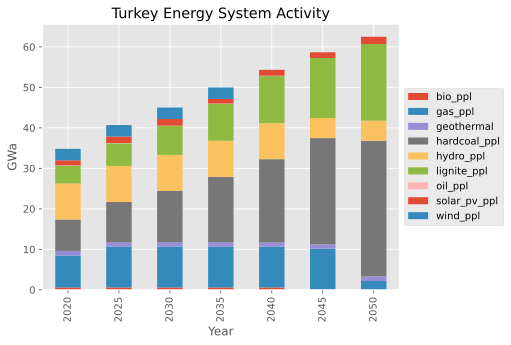
    


```python
emissions = {
    'lignite_ppl': ('CO2', 1.708),
    'hardcoal_ppl': ('CO2', 0.854), # units: tCO2/MWh
    'gas_ppl':  ('CO2', 0.339), # units: tCO2/MWh
    'oil_ppl':  ('CO2', 0.57),  # units: tCO2/MWh
}
```

# Wind Subsidies

Rerun the wind subsidy scenario using this framework.


```python
# Percent subsidy by year
subsidies = np.array([0, 0.1, 0.2, 0.3, 0.4, 0.5, 0.5])

with solve_modified(base_scen, new_name="wind_subsidies") as wind_scen:
    # Load the investment cost data (cloned from `base_scen`) for wind_ppl
    data = wind_scen.par("inv_cost", filters=dict(technology="wind_ppl"))
    
    # Reduce the values according to the subsidy
    data["value"] = data["value"] * subsidies
    
    # Overwrite the values in `wind_scen` at the same indices
    wind_scen.add_par("inv_cost", data)
    
# Display the new costs
data
```

    --- Warning: The GAMS version [51.3.0] differs from the API version [24.8.3].
    --- Job MESSAGE_run.gms Start 09/28/26 21:01:33 51.3.0 38407a9b LEX-LEG x86 64bit/Linux
    --- Applying:
        /home/ggungor/Downloads/gams51.3_linux_x64_64_sfx/gmsprmun.txt
    --- GAMS Parameters defined
        Input /home/ggungor/miniconda3/lib/python3.12/site-packages/message_ix/model/MESSAGE_run.gms
        ScrDir /home/ggungor/miniconda3/lib/python3.12/site-packages/message_ix/model/225a/
        SysDir /home/ggungor/Downloads/gams51.3_linux_x64_64_sfx/
        LogOption 4
        LogFile /home/ggungor/miniconda3/lib/python3.12/site-packages/message_ix/model/MESSAGE_run.log
        AppendLog 1
        --in /home/ggungor/miniconda3/lib/python3.12/site-packages/message_ix/model/data/MsgData_Turkey_energy_model_wind_subsidies.gdx
        --out /home/ggungor/miniconda3/lib/python3.12/site-packages/message_ix/model/output/MsgOutput_Turkey_energy_model_wind_subsidies.gdx
        --iter /home/ggungor/miniconda3/lib/python3.12/site-packages/message_ix/model/output/MsgIterationReport_Turkey_energy_model_wind_subsidies.gdx
    Licensee: G?rkem G?ng?r                                  G260118+0003Ac-GEN
              ggungor@mezun.hacettepe.edu.tr                          CLA115848
              /home/ggungor/Downloads/gams51.3_linux_x64_64_sfx/gamslice.txt
              node:60351003 v:2                                                
              Community license for demonstration and instructional purposes only
    System information: 2 physical cores and 4 Gb physical memory detected
    GAMS 51.3.0   Copyright (C) 1987-2025 GAMS Development. All rights reserved
    --- Starting compilation
    --- MESSAGE_run.gms(3) 2 Mb
    --- . copyright.gms(29) 2 Mb
    --- MESSAGE_run.gms(30) 2 Mb
    --- . model_setup.gms(66) 2 Mb
    --- .. auxiliary_settings.gms(37) 2 Mb
    --- . model_setup.gms(69) 2 Mb
    --- .. version.gms(23) 2 Mb
    --- . model_setup.gms(70) 2 Mb
    --- .. version_check.gms(7) 2 Mb
    --- GDXin=/home/ggungor/miniconda3/lib/python3.12/site-packages/message_ix/model/data/MsgData_Turkey_energy_model_wind_subsidies.gdx
    --- GDX File ($gdxIn) /home/ggungor/miniconda3/lib/python3.12/site-packages/message_ix/model/data/MsgData_Turkey_energy_model_wind_subsidies.gdx
    --- .. version_check.gms(24) 3 Mb
    --- . model_setup.gms(73) 3 Mb
    --- .. sets_maps_def.gms(511) 3 Mb
    --- . model_setup.gms(74) 3 Mb
    --- .. parameter_def.gms(907) 3 Mb
    --- . model_setup.gms(77) 3 Mb
    --- .. data_load.gms(9) 3 Mb
    --- GDXin=/home/ggungor/miniconda3/lib/python3.12/site-packages/message_ix/model/data/MsgData_Turkey_energy_model_wind_subsidies.gdx
    --- GDX File ($gdxIn) /home/ggungor/miniconda3/lib/python3.12/site-packages/message_ix/model/data/MsgData_Turkey_energy_model_wind_subsidies.gdx
    --- .. data_load.gms(126) 3 Mb
    --- ... period_parameter_assignment.gms(118) 3 Mb
    --- .. data_load.gms(269) 3 Mb
    --- . model_setup.gms(80) 3 Mb
    --- .. scaling_investment_costs.gms(182) 3 Mb
    --- . model_setup.gms(86) 3 Mb
    --- .. model_core.gms(2339) 3 Mb
    --- . model_setup.gms(86) 3 Mb
    --- MESSAGE_run.gms(36) 3 Mb
    --- . model_solve.gms(109) 3 Mb
    --- .. aux_computation_time.gms(14) 3 Mb
    --- . model_solve.gms(175) 3 Mb
    --- MESSAGE_run.gms(43) 3 Mb
    --- . reporting.gms(26) 3 Mb
    --- MESSAGE_run.gms(52) 3 Mb
    --- Starting execution: elapsed 0:00:00.347
    --- MESSAGE_run.gms(1644) 4 Mb
        +++ Importing data from '/home/ggungor/miniconda3/lib/python3.12/site-packages/message_ix/model/data/MsgData_Turkey_energy_model_wind_subsidies.gdx'... +++
    --- MESSAGE_run.gms(1669) 4 Mb
    --- GDXin=/home/ggungor/miniconda3/lib/python3.12/site-packages/message_ix/model/data/MsgData_Turkey_energy_model_wind_subsidies.gdx
    --- GDX File (execute_load) /home/ggungor/miniconda3/lib/python3.12/site-packages/message_ix/model/data/MsgData_Turkey_energy_model_wind_subsidies.gdx
    --- MESSAGE_run.gms(4570) 4 Mb
        +++ Solve the perfect-foresight version of MESSAGEix +++
    --- Generating LP model MESSAGE_LP
    --- MESSAGE_run.gms(4588) 5 Mb
    ---   760 rows  621 columns  2,651 non-zeroes
    --- Range statistics (absolute non-zero finite values)
    --- RHS       [min, max] : [ 8.037E-02, 4.462E+01] - Zero values observed as well
    --- Bound     [min, max] : [        NA,        NA] - Zero values observed as well
    --- Matrix    [min, max] : [ 1.000E-01, 3.100E+03]
    --- Executing CPLEX (Solvelink=2): elapsed 0:00:00.727
    
    IBM ILOG CPLEX   51.3.0 38407a9b Oct 27, 2025          LEG x86 64bit/Linux    
    
    *** This solver runs with a community license. No commercial use.
    
    Reading parameter(s) from "/home/ggungor/miniconda3/lib/python3.12/site-packages/message_ix/model/cplex.opt"
    >>  advind = 0
    >>  lpmethod = 4
    >>  threads = 4
    >>  epopt = 1e-06
    Finished reading from "/home/ggungor/miniconda3/lib/python3.12/site-packages/message_ix/model/cplex.opt"
    
    --- GMO setup time: 0.00s
    --- Space for names approximately 0.07 Mb
    --- Use option 'names no' to turn use of names off
    --- GMO memory 0.66 Mb (peak 0.66 Mb)
    --- Dictionary memory 0.00 Mb
    --- Cplex 22.1.2.0 link memory 0.02 Mb (peak 0.13 Mb)
    --- Starting Cplex
    
    Version identifier: 22.1.2.0 | 2024-11-26 | 0edbb82fd
    CPXPARAM_Advance                                 0
    CPXPARAM_LPMethod                                4
    CPXPARAM_Threads                                 4
    CPXPARAM_Parallel                                1
    CPXPARAM_MIP_Display                             4
    CPXPARAM_MIP_Pool_Capacity                       0
    CPXPARAM_Barrier_Limits_Iteration                100000000
    CPXPARAM_TimeLimit                               1000000
    CPXPARAM_MIP_Tolerances_AbsMIPGap                0
    CPXPARAM_MIP_Tolerances_MIPGap                   0
    Tried aggregator 1 time.
    LP Presolve eliminated 269 rows and 142 columns.
    Aggregator did 118 substitutions.
    Reduced LP has 372 rows, 411 columns, and 1338 nonzeros.
    Presolve time = 0.25 sec. (0.96 ticks)
    Parallel mode: using up to 4 threads for barrier.
    Number of nonzeros in lower triangle of A*A' = 1217
    Using Approximate Minimum Degree ordering
    Total time for automatic ordering = 0.00 sec. (0.20 ticks)
    Summary statistics for Cholesky factor:
      Threads                   = 4
      Rows in Factor            = 372
      Integer space required    = 795
      Total non-zeros in factor = 4477
      Total FP ops to factor    = 64047
     Itn      Primal Obj        Dual Obj  Prim Inf Upper Inf  Dual Inf Inf Ratio
       0   2.2188266e+06   2.2164042e+05  8.41e+03  8.97e+01  4.60e+03  1.00e+00
       1   1.8529365e+06   2.2510590e+05  6.86e+03  7.32e+01  2.16e+03  1.95e-03
       2   1.4253449e+06   2.4444756e+05  5.00e+03  5.33e+01  1.42e+03  1.67e-03
       3   1.1763273e+06   2.9434336e+05  3.78e+03  4.03e+01  9.81e+02  1.67e-03
       4   7.8182791e+05   3.0222041e+05  2.02e+03  2.15e+01  7.57e+02  1.80e-03
       5   6.1958708e+05   3.4824814e+05  1.23e+03  1.32e+01  1.98e+02  4.16e-03
       6   5.0996529e+05   3.6768226e+05  6.70e+02  7.14e+00  7.68e+01  9.54e-03
       7   4.3426667e+05   3.7736742e+05  2.69e+02  2.87e+00  2.97e+01  1.94e-02
       8   4.0497114e+05   3.8306875e+05  1.02e+02  1.09e+00  1.22e+01  3.58e-02
       9   3.9786003e+05   3.8555430e+05  4.88e+01  5.20e-01  8.53e+00  4.60e-02
      10   3.9259369e+05   3.8939442e+05  1.46e+01  1.56e-01  1.70e+00  2.33e-01
      11   3.9106517e+05   3.9010716e+05  4.33e+00  4.62e-02  5.17e-01  7.19e-01
      12   3.9060965e+05   3.9038442e+05  1.20e+00  1.28e-02  7.87e-02  4.30e+00
      13   3.9047254e+05   3.9042008e+05  2.72e-01  2.91e-03  2.03e-02  1.02e+01
      14   3.9044884e+05   3.9044349e+05  3.41e-02  3.64e-04  1.57e-03  1.33e+02
      15   3.9044566e+05   3.9044499e+05  3.65e-03  3.89e-05  2.47e-04  7.16e+02
      16   3.9044534e+05   3.9044534e+05  1.57e-06  1.67e-08  1.81e-07  9.95e+05
      17   3.9044534e+05   3.9044534e+05  3.14e-09  1.72e-12  5.38e-08  1.29e+10
    Barrier time = 0.28 sec. (3.09 ticks)
    Parallel mode: deterministic, using up to 4 threads for concurrent optimization:
     * Starting dual Simplex on 1 thread...
     * Starting primal Simplex on 1 thread...
    
    Dual crossover.
      Dual:  Fixing 137 variables.
          136 DMoves:  Infeasibility  0.00000000e+00  Objective  3.90445343e+05
           55 DMoves:  Infeasibility  0.00000000e+00  Objective  3.90445343e+05
            0 DMoves:  Infeasibility  0.00000000e+00  Objective  3.90445343e+05
      Dual:  Pushed 7, exchanged 130.
      Primal:  Fixed no variables.
    
    Dual simplex solved model.
    
    Total crossover time = 0.22 sec. (1.02 ticks)
    
    Total time on 4 threads = 0.76 sec. (5.09 ticks)
    
    --- LP status (1): optimal.
    --- Cplex Time: 1.47sec (det. 5.09 ticks)
    
    
    Optimal solution found
    Objective:       390445.342675
    
    --- Reading solution for model MESSAGE_LP
    --- Executing after solve: elapsed 0:00:11.054
    --- MESSAGE_run.gms(4786) 5 Mb
    --- GDX File (execute_unload) /home/ggungor/miniconda3/lib/python3.12/site-packages/message_ix/model/output/MsgOutput_Turkey_energy_model_wind_subsidies.gdx
    --- MESSAGE_run.gms(4788) 5 Mb
        +++ End of MESSAGEix (stand-alone) run - have a nice day! +++
    *** Status: Normal completion
    --- Job MESSAGE_run.gms Stop 09/28/26 21:01:44 elapsed 0:00:11.076
    --- Warning: The GAMS version [51.3.0] differs from the API version [24.8.3].
    --- Warning: The GAMS version [51.3.0] differs from the API version [24.8.3].


    2026-09-28 21:01:45,060 ERROR at.ac.iiasa.ixmp.objects.Scenario:1691 - variable 'I' not found in gdx!
    2026-09-28 21:01:45,063 ERROR at.ac.iiasa.ixmp.objects.Scenario:1691 - variable 'C' not found in gdx!


<div>
<style scoped>
    .dataframe tbody tr th:only-of-type {
        vertical-align: middle;
    }

    .dataframe tbody tr th {
        vertical-align: top;
    }

    .dataframe thead th {
        text-align: right;
    }
</style>
<table border="1" class="dataframe">
  <thead>
    <tr style="text-align: right;">
      <th></th>
      <th>node_loc</th>
      <th>technology</th>
      <th>year_vtg</th>
      <th>value</th>
      <th>unit</th>
    </tr>
  </thead>
  <tbody>
    <tr>
      <th>0</th>
      <td>Turkey</td>
      <td>wind_ppl</td>
      <td>2020</td>
      <td>0.0</td>
      <td>USD/kW</td>
    </tr>
    <tr>
      <th>1</th>
      <td>Turkey</td>
      <td>wind_ppl</td>
      <td>2025</td>
      <td>176.7</td>
      <td>USD/kW</td>
    </tr>
    <tr>
      <th>2</th>
      <td>Turkey</td>
      <td>wind_ppl</td>
      <td>2030</td>
      <td>353.4</td>
      <td>USD/kW</td>
    </tr>
    <tr>
      <th>3</th>
      <td>Turkey</td>
      <td>wind_ppl</td>
      <td>2035</td>
      <td>530.1</td>
      <td>USD/kW</td>
    </tr>
    <tr>
      <th>4</th>
      <td>Turkey</td>
      <td>wind_ppl</td>
      <td>2040</td>
      <td>706.8</td>
      <td>USD/kW</td>
    </tr>
    <tr>
      <th>5</th>
      <td>Turkey</td>
      <td>wind_ppl</td>
      <td>2045</td>
      <td>883.5</td>
      <td>USD/kW</td>
    </tr>
    <tr>
      <th>6</th>
      <td>Turkey</td>
      <td>wind_ppl</td>
      <td>2050</td>
      <td>883.5</td>
      <td>USD/kW</td>
    </tr>
  </tbody>
</table>
</div>


```python
# Prepare a Reporter based on the solved scenario
wind_rep = Reporter.from_scenario(wind_scen)
prepare_plots(wind_rep)

# Run the same reporting on both the base and modified scenarios
for r in base_rep, wind_rep:
    r.set_filters(t=plants)
    r.get("plot new capacity")
```


    
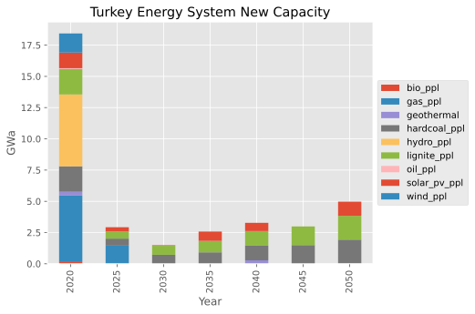
    


    
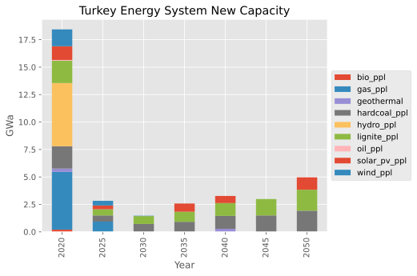
    


```python
wind_rep.get("plot activity")
```


    <Axes: title={'center': 'Turkey Energy System Activity'}, xlabel='Year', ylabel='GWa'>


    
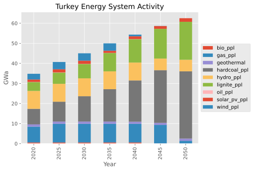
    


# Demand-Side Learning

This model does not use `cfl`s in the baseline because they are too expensive. What happens if their cost reduces with time?


```python
# Cost as a fraction of the baseline cost, due to learning
learning = np.array([1.0, 0.8, 0.6, 0.4, 0.2, 0.1, 0.05])

with solve_modified(base_scen, new_name="cheap_cfls") as cfl_scen:
    # Load the investment cost data (cloned from `base_scen`) for cfl
    data = cfl_scen.par("inv_cost", filters=dict(technology="high_efficiency"))
    
    # Reduce the values according to the learning curve
    data["value"] = data["value"] * learning
    
    # Overwrite the values in `cfl_scen` at the same indices
    cfl_scen.add_par("inv_cost", data)

# Display the new costs
data
```

    --- Warning: The GAMS version [51.3.0] differs from the API version [24.8.3].
    --- Job MESSAGE_run.gms Start 09/28/26 21:04:04 51.3.0 38407a9b LEX-LEG x86 64bit/Linux
    --- Applying:
        /home/ggungor/Downloads/gams51.3_linux_x64_64_sfx/gmsprmun.txt
    --- GAMS Parameters defined
        Input /home/ggungor/miniconda3/lib/python3.12/site-packages/message_ix/model/MESSAGE_run.gms
        ScrDir /home/ggungor/miniconda3/lib/python3.12/site-packages/message_ix/model/225a/
        SysDir /home/ggungor/Downloads/gams51.3_linux_x64_64_sfx/
        LogOption 4
        LogFile /home/ggungor/miniconda3/lib/python3.12/site-packages/message_ix/model/MESSAGE_run.log
        AppendLog 1
        --in /home/ggungor/miniconda3/lib/python3.12/site-packages/message_ix/model/data/MsgData_Turkey_energy_model_cheap_cfls.gdx
        --out /home/ggungor/miniconda3/lib/python3.12/site-packages/message_ix/model/output/MsgOutput_Turkey_energy_model_cheap_cfls.gdx
        --iter /home/ggungor/miniconda3/lib/python3.12/site-packages/message_ix/model/output/MsgIterationReport_Turkey_energy_model_cheap_cfls.gdx
    Licensee: G?rkem G?ng?r                                  G260118+0003Ac-GEN
              ggungor@mezun.hacettepe.edu.tr                          CLA115848
              /home/ggungor/Downloads/gams51.3_linux_x64_64_sfx/gamslice.txt
              node:60351003 v:2                                                
              Community license for demonstration and instructional purposes only
    System information: 2 physical cores and 4 Gb physical memory detected
    GAMS 51.3.0   Copyright (C) 1987-2025 GAMS Development. All rights reserved
    --- Starting compilation
    --- MESSAGE_run.gms(3) 2 Mb
    --- . copyright.gms(29) 2 Mb
    --- MESSAGE_run.gms(30) 2 Mb
    --- . model_setup.gms(66) 2 Mb
    --- .. auxiliary_settings.gms(37) 2 Mb
    --- . model_setup.gms(69) 2 Mb
    --- .. version.gms(23) 2 Mb
    --- . model_setup.gms(70) 2 Mb
    --- .. version_check.gms(7) 2 Mb
    --- GDXin=/home/ggungor/miniconda3/lib/python3.12/site-packages/message_ix/model/data/MsgData_Turkey_energy_model_cheap_cfls.gdx
    --- GDX File ($gdxIn) /home/ggungor/miniconda3/lib/python3.12/site-packages/message_ix/model/data/MsgData_Turkey_energy_model_cheap_cfls.gdx
    --- .. version_check.gms(24) 3 Mb
    --- . model_setup.gms(73) 3 Mb
    --- .. sets_maps_def.gms(511) 3 Mb
    --- . model_setup.gms(74) 3 Mb
    --- .. parameter_def.gms(907) 3 Mb
    --- . model_setup.gms(77) 3 Mb
    --- .. data_load.gms(9) 3 Mb
    --- GDXin=/home/ggungor/miniconda3/lib/python3.12/site-packages/message_ix/model/data/MsgData_Turkey_energy_model_cheap_cfls.gdx
    --- GDX File ($gdxIn) /home/ggungor/miniconda3/lib/python3.12/site-packages/message_ix/model/data/MsgData_Turkey_energy_model_cheap_cfls.gdx
    --- .. data_load.gms(126) 3 Mb
    --- ... period_parameter_assignment.gms(118) 3 Mb
    --- .. data_load.gms(269) 3 Mb
    --- . model_setup.gms(80) 3 Mb
    --- .. scaling_investment_costs.gms(182) 3 Mb
    --- . model_setup.gms(86) 3 Mb
    --- .. model_core.gms(2339) 3 Mb
    --- . model_setup.gms(86) 3 Mb
    --- MESSAGE_run.gms(36) 3 Mb
    --- . model_solve.gms(109) 3 Mb
    --- .. aux_computation_time.gms(14) 3 Mb
    --- . model_solve.gms(175) 3 Mb
    --- MESSAGE_run.gms(43) 3 Mb
    --- . reporting.gms(26) 3 Mb
    --- MESSAGE_run.gms(52) 3 Mb
    --- Starting execution: elapsed 0:00:00.322
    --- MESSAGE_run.gms(1644) 4 Mb
        +++ Importing data from '/home/ggungor/miniconda3/lib/python3.12/site-packages/message_ix/model/data/MsgData_Turkey_energy_model_cheap_cfls.gdx'... +++
    --- MESSAGE_run.gms(1669) 4 Mb
    --- GDXin=/home/ggungor/miniconda3/lib/python3.12/site-packages/message_ix/model/data/MsgData_Turkey_energy_model_cheap_cfls.gdx
    --- GDX File (execute_load) /home/ggungor/miniconda3/lib/python3.12/site-packages/message_ix/model/data/MsgData_Turkey_energy_model_cheap_cfls.gdx
    --- MESSAGE_run.gms(4570) 4 Mb
        +++ Solve the perfect-foresight version of MESSAGEix +++
    --- Generating LP model MESSAGE_LP
    --- MESSAGE_run.gms(4588) 5 Mb
    ---   760 rows  621 columns  2,652 non-zeroes
    --- Range statistics (absolute non-zero finite values)
    --- RHS       [min, max] : [ 8.037E-02, 4.462E+01] - Zero values observed as well
    --- Bound     [min, max] : [        NA,        NA] - Zero values observed as well
    --- Matrix    [min, max] : [ 1.000E-01, 3.100E+03]
    --- Executing CPLEX (Solvelink=2): elapsed 0:00:00.394
    
    IBM ILOG CPLEX   51.3.0 38407a9b Oct 27, 2025          LEG x86 64bit/Linux    
    
    *** This solver runs with a community license. No commercial use.
    
    Reading parameter(s) from "/home/ggungor/miniconda3/lib/python3.12/site-packages/message_ix/model/cplex.opt"
    >>  advind = 0
    >>  lpmethod = 4
    >>  threads = 4
    >>  epopt = 1e-06
    Finished reading from "/home/ggungor/miniconda3/lib/python3.12/site-packages/message_ix/model/cplex.opt"
    
    --- GMO setup time: 0.00s
    --- Space for names approximately 0.07 Mb
    --- Use option 'names no' to turn use of names off
    --- GMO memory 0.66 Mb (peak 0.66 Mb)
    --- Dictionary memory 0.00 Mb
    --- Cplex 22.1.2.0 link memory 0.02 Mb (peak 0.13 Mb)
    --- Starting Cplex
    
    Version identifier: 22.1.2.0 | 2024-11-26 | 0edbb82fd
    CPXPARAM_Advance                                 0
    CPXPARAM_LPMethod                                4
    CPXPARAM_Threads                                 4
    CPXPARAM_Parallel                                1
    CPXPARAM_MIP_Display                             4
    CPXPARAM_MIP_Pool_Capacity                       0
    CPXPARAM_Barrier_Limits_Iteration                100000000
    CPXPARAM_TimeLimit                               1000000
    CPXPARAM_MIP_Tolerances_AbsMIPGap                0
    CPXPARAM_MIP_Tolerances_MIPGap                   0
    Tried aggregator 1 time.
    LP Presolve eliminated 268 rows and 141 columns.
    Aggregator did 119 substitutions.
    Reduced LP has 372 rows, 411 columns, and 1338 nonzeros.
    Presolve time = 0.25 sec. (0.96 ticks)
    Parallel mode: using up to 4 threads for barrier.
    Number of nonzeros in lower triangle of A*A' = 1217
    Using Approximate Minimum Degree ordering
    Total time for automatic ordering = 0.00 sec. (0.20 ticks)
    Summary statistics for Cholesky factor:
      Threads                   = 4
      Rows in Factor            = 372
      Integer space required    = 795
      Total non-zeros in factor = 4477
      Total FP ops to factor    = 64047
     Itn      Primal Obj        Dual Obj  Prim Inf Upper Inf  Dual Inf Inf Ratio
       0   2.2673771e+06   2.3815682e+05  8.41e+03  8.97e+01  4.60e+03  1.00e+00
       1   1.8674802e+06   2.3906505e+05  6.75e+03  7.20e+01  2.88e+03  2.63e-03
       2   1.4841390e+06   2.5183329e+05  5.12e+03  5.46e+01  2.03e+03  2.00e-03
       3   1.1954471e+06   3.0982940e+05  3.78e+03  4.03e+01  1.10e+03  1.84e-03
       4   7.9939306e+05   3.2060829e+05  1.99e+03  2.12e+01  8.63e+02  1.90e-03
       5   5.8758275e+05   3.4711996e+05  1.02e+03  1.08e+01  3.72e+02  3.25e-03
       6   5.2937943e+05   3.6867166e+05  7.18e+02  7.66e+00  1.81e+02  5.66e-03
       7   4.4276381e+05   3.7808821e+05  2.72e+02  2.90e+00  1.01e+02  9.47e-03
       8   4.2158446e+05   3.8758707e+05  1.56e+02  1.67e+00  3.61e+01  2.36e-02
       9   4.0568794e+05   3.9175392e+05  6.08e+01  6.48e-01  1.73e+01  4.71e-02
      10   4.0059626e+05   3.9443585e+05  3.06e+01  3.26e-01  4.71e+00  1.63e-01
      11   3.9637641e+05   3.9492548e+05  5.98e+00  6.37e-02  2.20e+00  2.82e-01
      12   3.9586598e+05   3.9543217e+05  1.51e+00  1.62e-02  7.46e-01  8.88e-01
      13   3.9570653e+05   3.9558562e+05  2.13e-01  2.27e-03  2.85e-01  2.50e+00
      14   3.9566783e+05   3.9563785e+05  5.86e-03  6.25e-05  1.01e-01  7.20e+00
      15   3.9566575e+05   3.9566409e+05  3.62e-04  3.86e-06  5.54e-03  4.05e+02
      16   3.9566461e+05   3.9566461e+05  2.99e-07  3.19e-09  4.57e-06  5.60e+05
      17   3.9566461e+05   3.9566461e+05  3.21e-10  3.74e-13  1.11e-09  5.65e+09
    Barrier time = 0.68 sec. (3.08 ticks)
    Parallel mode: deterministic, using up to 4 threads for concurrent optimization:
     * Starting dual Simplex on 1 thread...
     * Starting primal Simplex on 1 thread...
    
    Dual crossover.
      Dual:  Fixing 178 variables.
          177 DMoves:  Infeasibility  0.00000000e+00  Objective  3.95664607e+05
           47 DMoves:  Infeasibility  0.00000000e+00  Objective  3.95664607e+05
            0 DMoves:  Infeasibility  0.00000000e+00  Objective  3.95664607e+05
      Dual:  Pushed 27, exchanged 151.
      Primal:  Fixing 3 variables.
            2 PMoves:  Infeasibility  3.55271368e-15  Objective  3.95664607e+05
            0 PMoves:  Infeasibility  3.55271368e-15  Objective  3.95664607e+05
      Primal:  Pushed 0, exchanged 3.
    
    Dual simplex solved model.
    
    Total crossover time = 0.50 sec. (1.08 ticks)
    
    Total time on 4 threads = 1.44 sec. (5.15 ticks)
    
    --- LP status (1): optimal.
    --- Cplex Time: 1.62sec (det. 5.16 ticks)
    
    
    Optimal solution found
    Objective:       395664.607312
    
    --- Reading solution for model MESSAGE_LP
    --- Executing after solve: elapsed 0:00:03.936
    --- MESSAGE_run.gms(4786) 5 Mb
    --- GDX File (execute_unload) /home/ggungor/miniconda3/lib/python3.12/site-packages/message_ix/model/output/MsgOutput_Turkey_energy_model_cheap_cfls.gdx
    --- MESSAGE_run.gms(4788) 5 Mb
        +++ End of MESSAGEix (stand-alone) run - have a nice day! +++
    *** Status: Normal completion
    --- Job MESSAGE_run.gms Stop 09/28/26 21:04:08 elapsed 0:00:03.944
    --- Warning: The GAMS version [51.3.0] differs from the API version [24.8.3].
    --- Warning: The GAMS version [51.3.0] differs from the API version [24.8.3].


    2026-09-28 21:04:09,437 ERROR at.ac.iiasa.ixmp.objects.Scenario:1691 - variable 'I' not found in gdx!
    2026-09-28 21:04:09,438 ERROR at.ac.iiasa.ixmp.objects.Scenario:1691 - variable 'C' not found in gdx!


<div>
<style scoped>
    .dataframe tbody tr th:only-of-type {
        vertical-align: middle;
    }

    .dataframe tbody tr th {
        vertical-align: top;
    }

    .dataframe thead th {
        text-align: right;
    }
</style>
<table border="1" class="dataframe">
  <thead>
    <tr style="text-align: right;">
      <th></th>
      <th>node_loc</th>
      <th>technology</th>
      <th>year_vtg</th>
      <th>value</th>
      <th>unit</th>
    </tr>
  </thead>
  <tbody>
    <tr>
      <th>0</th>
      <td>Turkey</td>
      <td>high_efficiency</td>
      <td>2020</td>
      <td>900.0</td>
      <td>USD/kW</td>
    </tr>
    <tr>
      <th>1</th>
      <td>Turkey</td>
      <td>high_efficiency</td>
      <td>2025</td>
      <td>720.0</td>
      <td>USD/kW</td>
    </tr>
    <tr>
      <th>2</th>
      <td>Turkey</td>
      <td>high_efficiency</td>
      <td>2030</td>
      <td>540.0</td>
      <td>USD/kW</td>
    </tr>
    <tr>
      <th>3</th>
      <td>Turkey</td>
      <td>high_efficiency</td>
      <td>2035</td>
      <td>360.0</td>
      <td>USD/kW</td>
    </tr>
    <tr>
      <th>4</th>
      <td>Turkey</td>
      <td>high_efficiency</td>
      <td>2040</td>
      <td>180.0</td>
      <td>USD/kW</td>
    </tr>
    <tr>
      <th>5</th>
      <td>Turkey</td>
      <td>high_efficiency</td>
      <td>2045</td>
      <td>90.0</td>
      <td>USD/kW</td>
    </tr>
    <tr>
      <th>6</th>
      <td>Turkey</td>
      <td>high_efficiency</td>
      <td>2050</td>
      <td>45.0</td>
      <td>USD/kW</td>
    </tr>
  </tbody>
</table>
</div>


```python
# Prepare a Reporter based on the solved scenario
cfl_rep = Reporter.from_scenario(cfl_scen)
prepare_plots(cfl_rep)

# Run the same reporting on both the base and modified scenarios
for r in base_rep, cfl_rep:
    r.set_filters(t=light_and_appliance)
    r.get("plot capacity")
```


    
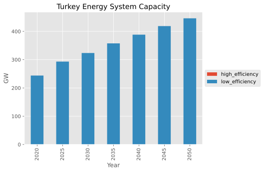
    


    
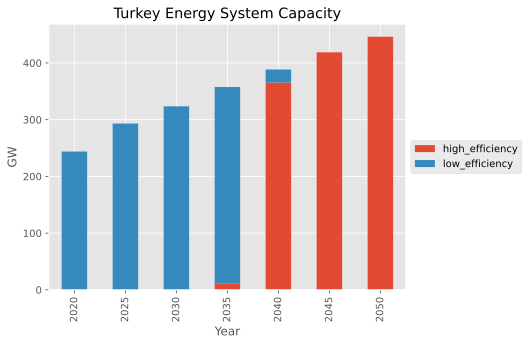
    


```python
for r in base_rep, cfl_rep:
    r.set_filters(t=plants)
    r.get("plot activity")
```


    

    


    
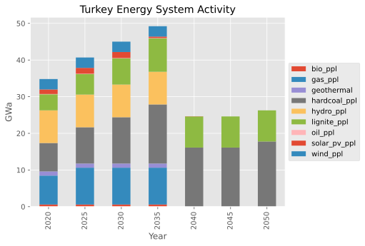
    


# Exercise: Economic Assumptions

What is the effect of assuming a different interest rate? What if it is higher than the baseline? Lower? How does this affect prices?


```python
# Show the baseline interest rate
base_scen.par('interestrate')
```


<div>
<style scoped>
    .dataframe tbody tr th:only-of-type {
        vertical-align: middle;
    }

    .dataframe tbody tr th {
        vertical-align: top;
    }

    .dataframe thead th {
        text-align: right;
    }
</style>
<table border="1" class="dataframe">
  <thead>
    <tr style="text-align: right;">
      <th></th>
      <th>year</th>
      <th>value</th>
      <th>unit</th>
    </tr>
  </thead>
  <tbody>
    <tr>
      <th>0</th>
      <td>2020</td>
      <td>0.1</td>
      <td>-</td>
    </tr>
    <tr>
      <th>1</th>
      <td>2025</td>
      <td>0.1</td>
      <td>-</td>
    </tr>
    <tr>
      <th>2</th>
      <td>2030</td>
      <td>0.1</td>
      <td>-</td>
    </tr>
    <tr>
      <th>3</th>
      <td>2035</td>
      <td>0.1</td>
      <td>-</td>
    </tr>
    <tr>
      <th>4</th>
      <td>2040</td>
      <td>0.1</td>
      <td>-</td>
    </tr>
    <tr>
      <th>5</th>
      <td>2045</td>
      <td>0.1</td>
      <td>-</td>
    </tr>
    <tr>
      <th>6</th>
      <td>2050</td>
      <td>0.1</td>
      <td>-</td>
    </tr>
  </tbody>
</table>
</div>


```python
# Uncomment and complete the following code where "TODO" appears
# with solve_modified(base_scen, new_name="TODO") as econ_scen:
#    # TODO modify the interest rate to a different value

# Cost as a fraction of the baseline cost, due to learning
economy = np.array([1.0, 0.8, 0.6, 0.4, 0.2, 0.1, 0.1])

with solve_modified(base_scen, new_name="economy") as econ_scen:
    # Load the investment cost data (cloned from `base_scen`) for cfl
    data = econ_scen.par("interestrate")
    
    # Reduce the values according to the learning curve
    data["value"] = data["value"] * economy
    
    # Overwrite the values in `cfl_scen` at the same indices
    econ_scen.add_par("interestrate", data)

# Display the new costs
data
```

    --- Warning: The GAMS version [51.3.0] differs from the API version [24.8.3].
    --- Job MESSAGE_run.gms Start 09/28/26 21:09:05 51.3.0 38407a9b LEX-LEG x86 64bit/Linux
    --- Applying:
        /home/ggungor/Downloads/gams51.3_linux_x64_64_sfx/gmsprmun.txt
    --- GAMS Parameters defined
        Input /home/ggungor/miniconda3/lib/python3.12/site-packages/message_ix/model/MESSAGE_run.gms
        ScrDir /home/ggungor/miniconda3/lib/python3.12/site-packages/message_ix/model/225a/
        SysDir /home/ggungor/Downloads/gams51.3_linux_x64_64_sfx/
        LogOption 4
        LogFile /home/ggungor/miniconda3/lib/python3.12/site-packages/message_ix/model/MESSAGE_run.log
        AppendLog 1
        --in /home/ggungor/miniconda3/lib/python3.12/site-packages/message_ix/model/data/MsgData_Turkey_energy_model_economy.gdx
        --out /home/ggungor/miniconda3/lib/python3.12/site-packages/message_ix/model/output/MsgOutput_Turkey_energy_model_economy.gdx
        --iter /home/ggungor/miniconda3/lib/python3.12/site-packages/message_ix/model/output/MsgIterationReport_Turkey_energy_model_economy.gdx
    Licensee: G?rkem G?ng?r                                  G260118+0003Ac-GEN
              ggungor@mezun.hacettepe.edu.tr                          CLA115848
              /home/ggungor/Downloads/gams51.3_linux_x64_64_sfx/gamslice.txt
              node:60351003 v:2                                                
              Community license for demonstration and instructional purposes only
    System information: 2 physical cores and 4 Gb physical memory detected
    GAMS 51.3.0   Copyright (C) 1987-2025 GAMS Development. All rights reserved
    --- Starting compilation
    --- MESSAGE_run.gms(3) 2 Mb
    --- . copyright.gms(29) 2 Mb
    --- MESSAGE_run.gms(30) 2 Mb
    --- . model_setup.gms(66) 2 Mb
    --- .. auxiliary_settings.gms(37) 2 Mb
    --- . model_setup.gms(69) 2 Mb
    --- .. version.gms(23) 2 Mb
    --- . model_setup.gms(70) 2 Mb
    --- .. version_check.gms(7) 2 Mb
    --- GDXin=/home/ggungor/miniconda3/lib/python3.12/site-packages/message_ix/model/data/MsgData_Turkey_energy_model_economy.gdx
    --- GDX File ($gdxIn) /home/ggungor/miniconda3/lib/python3.12/site-packages/message_ix/model/data/MsgData_Turkey_energy_model_economy.gdx
    --- .. version_check.gms(24) 3 Mb
    --- . model_setup.gms(73) 3 Mb
    --- .. sets_maps_def.gms(511) 3 Mb
    --- . model_setup.gms(74) 3 Mb
    --- .. parameter_def.gms(907) 3 Mb
    --- . model_setup.gms(77) 3 Mb
    --- .. data_load.gms(9) 3 Mb
    --- GDXin=/home/ggungor/miniconda3/lib/python3.12/site-packages/message_ix/model/data/MsgData_Turkey_energy_model_economy.gdx
    --- GDX File ($gdxIn) /home/ggungor/miniconda3/lib/python3.12/site-packages/message_ix/model/data/MsgData_Turkey_energy_model_economy.gdx
    --- .. data_load.gms(126) 3 Mb
    --- ... period_parameter_assignment.gms(118) 3 Mb
    --- .. data_load.gms(269) 3 Mb
    --- . model_setup.gms(80) 3 Mb
    --- .. scaling_investment_costs.gms(182) 3 Mb
    --- . model_setup.gms(86) 3 Mb
    --- .. model_core.gms(2339) 3 Mb
    --- . model_setup.gms(86) 3 Mb
    --- MESSAGE_run.gms(36) 3 Mb
    --- . model_solve.gms(109) 3 Mb
    --- .. aux_computation_time.gms(14) 3 Mb
    --- . model_solve.gms(175) 3 Mb
    --- MESSAGE_run.gms(43) 3 Mb
    --- . reporting.gms(26) 3 Mb
    --- MESSAGE_run.gms(52) 3 Mb
    --- Starting execution: elapsed 0:00:01.250
    --- MESSAGE_run.gms(1644) 4 Mb
        +++ Importing data from '/home/ggungor/miniconda3/lib/python3.12/site-packages/message_ix/model/data/MsgData_Turkey_energy_model_economy.gdx'... +++
    --- MESSAGE_run.gms(1669) 4 Mb
    --- GDXin=/home/ggungor/miniconda3/lib/python3.12/site-packages/message_ix/model/data/MsgData_Turkey_energy_model_economy.gdx
    --- GDX File (execute_load) /home/ggungor/miniconda3/lib/python3.12/site-packages/message_ix/model/data/MsgData_Turkey_energy_model_economy.gdx
    --- MESSAGE_run.gms(4570) 4 Mb
        +++ Solve the perfect-foresight version of MESSAGEix +++
    --- Generating LP model MESSAGE_LP
    --- MESSAGE_run.gms(4588) 5 Mb
    ---   760 rows  621 columns  2,652 non-zeroes
    --- Range statistics (absolute non-zero finite values)
    --- RHS       [min, max] : [ 8.037E-02, 4.462E+01] - Zero values observed as well
    --- Bound     [min, max] : [        NA,        NA] - Zero values observed as well
    --- Matrix    [min, max] : [ 1.000E-01, 3.100E+03]
    --- Executing CPLEX (Solvelink=2): elapsed 0:00:01.367
    
    IBM ILOG CPLEX   51.3.0 38407a9b Oct 27, 2025          LEG x86 64bit/Linux    
    
    *** This solver runs with a community license. No commercial use.
    
    Reading parameter(s) from "/home/ggungor/miniconda3/lib/python3.12/site-packages/message_ix/model/cplex.opt"
    >>  advind = 0
    >>  lpmethod = 4
    >>  threads = 4
    >>  epopt = 1e-06
    Finished reading from "/home/ggungor/miniconda3/lib/python3.12/site-packages/message_ix/model/cplex.opt"
    
    --- GMO setup time: 0.00s
    --- Space for names approximately 0.07 Mb
    --- Use option 'names no' to turn use of names off
    --- GMO memory 0.66 Mb (peak 0.66 Mb)
    --- Dictionary memory 0.00 Mb
    --- Cplex 22.1.2.0 link memory 0.02 Mb (peak 0.13 Mb)
    --- Starting Cplex
    
    Version identifier: 22.1.2.0 | 2024-11-26 | 0edbb82fd
    CPXPARAM_Advance                                 0
    CPXPARAM_LPMethod                                4
    CPXPARAM_Threads                                 4
    CPXPARAM_Parallel                                1
    CPXPARAM_MIP_Display                             4
    CPXPARAM_MIP_Pool_Capacity                       0
    CPXPARAM_Barrier_Limits_Iteration                100000000
    CPXPARAM_TimeLimit                               1000000
    CPXPARAM_MIP_Tolerances_AbsMIPGap                0
    CPXPARAM_MIP_Tolerances_MIPGap                   0
    Tried aggregator 1 time.
    LP Presolve eliminated 268 rows and 141 columns.
    Aggregator did 119 substitutions.
    Reduced LP has 372 rows, 411 columns, and 1338 nonzeros.
    Presolve time = 0.04 sec. (0.96 ticks)
    Parallel mode: using up to 4 threads for barrier.
    Number of nonzeros in lower triangle of A*A' = 1217
    Using Approximate Minimum Degree ordering
    Total time for automatic ordering = 0.00 sec. (0.20 ticks)
    Summary statistics for Cholesky factor:
      Threads                   = 4
      Rows in Factor            = 372
      Integer space required    = 795
      Total non-zeros in factor = 4477
      Total FP ops to factor    = 64047
     Itn      Primal Obj        Dual Obj  Prim Inf Upper Inf  Dual Inf Inf Ratio
       0   3.0477681e+06   2.1502871e+05  8.41e+03  8.97e+01  3.82e+03  1.00e+00
       1   2.6906106e+06   2.1554834e+05  7.35e+03  7.84e+01  1.23e+03  1.13e-03
       2   1.9451380e+06   2.4713995e+05  5.03e+03  5.37e+01  8.77e+02  1.03e-03
       3   1.5763614e+06   3.4112175e+05  3.73e+03  3.98e+01  5.76e+02  1.10e-03
       4   1.0205351e+06   3.6010120e+05  1.95e+03  2.08e+01  4.20e+02  1.26e-03
       5   8.2063896e+05   4.2525969e+05  1.27e+03  1.35e+01  1.17e+02  3.02e-03
       6   6.4359334e+05   4.5310886e+05  6.30e+02  6.72e+00  4.20e+01  7.44e-03
       7   5.7301933e+05   4.6331159e+05  3.67e+02  3.92e+00  2.17e+01  1.25e-02
       8   5.2903482e+05   4.7215614e+05  2.01e+02  2.14e+00  6.83e+00  2.27e-02
       9   5.0830703e+05   4.7637835e+05  1.16e+02  1.24e+00  2.98e+00  3.68e-02
      10   4.9108052e+05   4.7801353e+05  4.10e+01  4.38e-01  2.07e+00  5.12e-02
      11   4.8473373e+05   4.8073141e+05  9.84e+00  1.05e-01  8.77e-01  1.17e-01
      12   4.8352611e+05   4.8223683e+05  3.85e+00  4.10e-02  2.23e-01  4.82e-01
      13   4.8304602e+05   4.8263901e+05  1.60e+00  1.71e-02  3.10e-02  3.37e+00
      14   4.8272808e+05   4.8271241e+05  7.18e-02  7.66e-04  3.09e-04  1.39e+02
      15   4.8271678e+05   4.8271264e+05  1.81e-02  1.93e-04  1.85e-04  1.37e+02
      16   4.8271455e+05   4.8271445e+05  7.38e-04  7.87e-06  7.78e-08  1.99e+05
      17   4.8271446e+05   4.8271446e+05  5.01e-06  5.29e-09  3.23e-07  4.11e+07
      18   4.8271446e+05   4.8271446e+05  2.20e-07  7.49e-13  6.07e-08  4.15e+10
    Barrier time = 0.46 sec. (3.23 ticks)
    Parallel mode: deterministic, using up to 4 threads for concurrent optimization:
     * Starting dual Simplex on 1 thread...
     * Starting primal Simplex on 1 thread...
    
    Dual crossover.
      Dual:  Fixing 135 variables.
          134 DMoves:  Infeasibility  0.00000000e+00  Objective  4.82714462e+05
           27 DMoves:  Infeasibility  0.00000000e+00  Objective  4.82714462e+05
            0 DMoves:  Infeasibility  0.00000000e+00  Objective  4.82714462e+05
      Dual:  Pushed 12, exchanged 123.
      Primal:  Fixed no variables.
    
    Dual simplex solved model.
    
    Total crossover time = 0.34 sec. (1.01 ticks)
    
    Total time on 4 threads = 0.85 sec. (5.23 ticks)
    
    --- LP status (1): optimal.
    --- Cplex Time: 0.87sec (det. 5.23 ticks)
    
    
    Optimal solution found
    Objective:       482714.461801
    
    --- Reading solution for model MESSAGE_LP
    --- Executing after solve: elapsed 0:00:04.142
    --- MESSAGE_run.gms(4786) 5 Mb
    --- GDX File (execute_unload) /home/ggungor/miniconda3/lib/python3.12/site-packages/message_ix/model/output/MsgOutput_Turkey_energy_model_economy.gdx
    --- MESSAGE_run.gms(4788) 5 Mb
        +++ End of MESSAGEix (stand-alone) run - have a nice day! +++
    *** Status: Normal completion
    --- Job MESSAGE_run.gms Stop 09/28/26 21:09:09 elapsed 0:00:04.352
    --- Warning: The GAMS version [51.3.0] differs from the API version [24.8.3].
    --- Warning: The GAMS version [51.3.0] differs from the API version [24.8.3].


    2026-09-28 21:09:10,000 ERROR at.ac.iiasa.ixmp.objects.Scenario:1691 - variable 'I' not found in gdx!
    2026-09-28 21:09:10,000 ERROR at.ac.iiasa.ixmp.objects.Scenario:1691 - variable 'C' not found in gdx!


<div>
<style scoped>
    .dataframe tbody tr th:only-of-type {
        vertical-align: middle;
    }

    .dataframe tbody tr th {
        vertical-align: top;
    }

    .dataframe thead th {
        text-align: right;
    }
</style>
<table border="1" class="dataframe">
  <thead>
    <tr style="text-align: right;">
      <th></th>
      <th>year</th>
      <th>value</th>
      <th>unit</th>
    </tr>
  </thead>
  <tbody>
    <tr>
      <th>0</th>
      <td>2020</td>
      <td>0.10</td>
      <td>-</td>
    </tr>
    <tr>
      <th>1</th>
      <td>2025</td>
      <td>0.08</td>
      <td>-</td>
    </tr>
    <tr>
      <th>2</th>
      <td>2030</td>
      <td>0.06</td>
      <td>-</td>
    </tr>
    <tr>
      <th>3</th>
      <td>2035</td>
      <td>0.04</td>
      <td>-</td>
    </tr>
    <tr>
      <th>4</th>
      <td>2040</td>
      <td>0.02</td>
      <td>-</td>
    </tr>
    <tr>
      <th>5</th>
      <td>2045</td>
      <td>0.01</td>
      <td>-</td>
    </tr>
    <tr>
      <th>6</th>
      <td>2050</td>
      <td>0.01</td>
      <td>-</td>
    </tr>
  </tbody>
</table>
</div>


```python
# TODO based on the examples above, plot (a) new capacity and (b) prices
# Prepare a Reporter based on the solved scenario
econ_rep = Reporter.from_scenario(econ_scen)
prepare_plots(econ_rep)

# Run the same reporting on both the base and modified scenarios
for r in base_rep, econ_rep:
    r.set_filters(t=plants)
    r.get("plot activity")
```


    

    


    
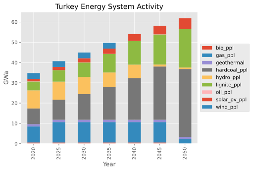
    


### Reporting emissions


```python
from message_ix import Reporter

econ_rep.set_filters(t=plants)
emissions_list = econ_rep.get("emi")
emissions_list
```


    nl      t        yv    ya    m         e    h   
    Turkey  gas_ppl  2020  2020  standard  CO2  year    23.42151
                           2025  standard  CO2  year    23.42151
                           2030  standard  CO2  year    23.42151
                           2035  standard  CO2  year    23.42151
                           2040  standard  CO2  year    23.42151
                                                          ...   
            oil_ppl  2040  2045  standard  CO2  year     0.00000
                           2050  standard  CO2  year     0.00000
                     2045  2045  standard  CO2  year     0.00000
                           2050  standard  CO2  year     0.00000
                     2050  2050  standard  CO2  year     0.00000
    Length: 110, dtype: float64, units: tCO2 / kWa


```python
print(econ_rep.get("EMISS"))
```

    n       e    type_tec  y   
    World   CO2  all       2020    147.324000
                           2025    187.923129
                           2030    231.471269
                           2035    287.050957
                           2040    357.986289
                           2045    448.519744
                           2050    540.243135
    Turkey  CO2  all       2020    147.324000
                           2025    187.923129
                           2030    231.471269
                           2035    287.050957
                           2040    357.986289
                           2045    448.519744
                           2050    540.243135
    Name: EMISS, dtype: float64, units: dimensionless


# Exercise: Carbon Tax

What effect does a carbon tax have on the system? What if it is phased in over time? What is the effect on energy prices?

Hints:

- Which emissions parameters are available from `scenario.par_list()`?
- Find out which fields are required using `scenario.idx_names(par_name)`
- Carbon taxes are normally provided in units of USD/tCO2
- A normal proposed carbon tax is ~30 USD/tCO2


```python
# Print the names of all parameters that contain "emission"
[name for name in base_scen.par_list() if "emission" in name]
```


    ['bound_emission',
     'emission_factor',
     'emission_scaling',
     'historical_emission',
     'land_emission',
     'tax_emission']


```python
# Print the index names for one of these
base_scen.idx_names("tax_emission")
```


    ['node', 'type_emission', 'type_tec', 'type_year']


```python
taxes = pd.DataFrame({
    "node": country,
    "type_emission": "GHGs",
    "type_year": horizon,
    "type_tec": "all",
    "value": np.array([0.0, 50.0, 100.0, 150.0, 200.0, 250.0, 300.0]),
    "unit": 'USD/tCO2', 
})

with solve_modified(base_scen, new_name="carbon_tax") as ctax_scen:
    ctax_scen.add_par('tax_emission', taxes)
```

    --- Warning: The GAMS version [51.3.0] differs from the API version [24.8.3].
    --- Job MESSAGE_run.gms Start 09/28/26 21:11:09 51.3.0 38407a9b LEX-LEG x86 64bit/Linux
    --- Applying:
        /home/ggungor/Downloads/gams51.3_linux_x64_64_sfx/gmsprmun.txt
    --- GAMS Parameters defined
        Input /home/ggungor/miniconda3/lib/python3.12/site-packages/message_ix/model/MESSAGE_run.gms
        ScrDir /home/ggungor/miniconda3/lib/python3.12/site-packages/message_ix/model/225a/
        SysDir /home/ggungor/Downloads/gams51.3_linux_x64_64_sfx/
        LogOption 4
        LogFile /home/ggungor/miniconda3/lib/python3.12/site-packages/message_ix/model/MESSAGE_run.log
        AppendLog 1
        --in /home/ggungor/miniconda3/lib/python3.12/site-packages/message_ix/model/data/MsgData_Turkey_energy_model_carbon_tax.gdx
        --out /home/ggungor/miniconda3/lib/python3.12/site-packages/message_ix/model/output/MsgOutput_Turkey_energy_model_carbon_tax.gdx
        --iter /home/ggungor/miniconda3/lib/python3.12/site-packages/message_ix/model/output/MsgIterationReport_Turkey_energy_model_carbon_tax.gdx
    Licensee: G?rkem G?ng?r                                  G260118+0003Ac-GEN
              ggungor@mezun.hacettepe.edu.tr                          CLA115848
              /home/ggungor/Downloads/gams51.3_linux_x64_64_sfx/gamslice.txt
              node:60351003 v:2                                                
              Community license for demonstration and instructional purposes only
    System information: 2 physical cores and 4 Gb physical memory detected
    GAMS 51.3.0   Copyright (C) 1987-2025 GAMS Development. All rights reserved
    --- Starting compilation
    --- MESSAGE_run.gms(3) 2 Mb
    --- . copyright.gms(29) 2 Mb
    --- MESSAGE_run.gms(30) 2 Mb
    --- . model_setup.gms(66) 2 Mb
    --- .. auxiliary_settings.gms(37) 2 Mb
    --- . model_setup.gms(69) 2 Mb
    --- .. version.gms(23) 2 Mb
    --- . model_setup.gms(70) 2 Mb
    --- .. version_check.gms(7) 2 Mb
    --- GDXin=/home/ggungor/miniconda3/lib/python3.12/site-packages/message_ix/model/data/MsgData_Turkey_energy_model_carbon_tax.gdx
    --- GDX File ($gdxIn) /home/ggungor/miniconda3/lib/python3.12/site-packages/message_ix/model/data/MsgData_Turkey_energy_model_carbon_tax.gdx
    --- .. version_check.gms(24) 3 Mb
    --- . model_setup.gms(73) 3 Mb
    --- .. sets_maps_def.gms(511) 3 Mb
    --- . model_setup.gms(74) 3 Mb
    --- .. parameter_def.gms(907) 3 Mb
    --- . model_setup.gms(77) 3 Mb
    --- .. data_load.gms(9) 3 Mb
    --- GDXin=/home/ggungor/miniconda3/lib/python3.12/site-packages/message_ix/model/data/MsgData_Turkey_energy_model_carbon_tax.gdx
    --- GDX File ($gdxIn) /home/ggungor/miniconda3/lib/python3.12/site-packages/message_ix/model/data/MsgData_Turkey_energy_model_carbon_tax.gdx
    --- .. data_load.gms(126) 3 Mb
    --- ... period_parameter_assignment.gms(118) 3 Mb
    --- .. data_load.gms(269) 3 Mb
    --- . model_setup.gms(80) 3 Mb
    --- .. scaling_investment_costs.gms(182) 3 Mb
    --- . model_setup.gms(86) 3 Mb
    --- .. model_core.gms(2339) 3 Mb
    --- . model_setup.gms(86) 3 Mb
    --- MESSAGE_run.gms(36) 3 Mb
    --- . model_solve.gms(109) 3 Mb
    --- .. aux_computation_time.gms(14) 3 Mb
    --- . model_solve.gms(175) 3 Mb
    --- MESSAGE_run.gms(43) 3 Mb
    --- . reporting.gms(26) 3 Mb
    --- MESSAGE_run.gms(52) 3 Mb
    --- Starting execution: elapsed 0:00:00.058
    --- MESSAGE_run.gms(1644) 4 Mb
        +++ Importing data from '/home/ggungor/miniconda3/lib/python3.12/site-packages/message_ix/model/data/MsgData_Turkey_energy_model_carbon_tax.gdx'... +++
    --- MESSAGE_run.gms(1669) 4 Mb
    --- GDXin=/home/ggungor/miniconda3/lib/python3.12/site-packages/message_ix/model/data/MsgData_Turkey_energy_model_carbon_tax.gdx
    --- GDX File (execute_load) /home/ggungor/miniconda3/lib/python3.12/site-packages/message_ix/model/data/MsgData_Turkey_energy_model_carbon_tax.gdx
    --- MESSAGE_run.gms(4570) 4 Mb
        +++ Solve the perfect-foresight version of MESSAGEix +++
    --- Generating LP model MESSAGE_LP
    --- MESSAGE_run.gms(4588) 5 Mb
    ---   760 rows  621 columns  2,658 non-zeroes
    --- Range statistics (absolute non-zero finite values)
    --- RHS       [min, max] : [ 8.037E-02, 4.462E+01] - Zero values observed as well
    --- Bound     [min, max] : [        NA,        NA] - Zero values observed as well
    --- Matrix    [min, max] : [ 1.000E-01, 3.100E+03]
    --- Executing CPLEX (Solvelink=2): elapsed 0:00:00.102
    
    IBM ILOG CPLEX   51.3.0 38407a9b Oct 27, 2025          LEG x86 64bit/Linux    
    
    *** This solver runs with a community license. No commercial use.
    
    Reading parameter(s) from "/home/ggungor/miniconda3/lib/python3.12/site-packages/message_ix/model/cplex.opt"
    >>  advind = 0
    >>  lpmethod = 4
    >>  threads = 4
    >>  epopt = 1e-06
    Finished reading from "/home/ggungor/miniconda3/lib/python3.12/site-packages/message_ix/model/cplex.opt"
    
    --- GMO setup time: 0.00s
    --- Space for names approximately 0.07 Mb
    --- Use option 'names no' to turn use of names off
    --- GMO memory 0.66 Mb (peak 0.66 Mb)
    --- Dictionary memory 0.00 Mb
    --- Cplex 22.1.2.0 link memory 0.02 Mb (peak 0.13 Mb)
    --- Starting Cplex
    
    Version identifier: 22.1.2.0 | 2024-11-26 | 0edbb82fd
    CPXPARAM_Advance                                 0
    CPXPARAM_LPMethod                                4
    CPXPARAM_Threads                                 4
    CPXPARAM_Parallel                                1
    CPXPARAM_MIP_Display                             4
    CPXPARAM_MIP_Pool_Capacity                       0
    CPXPARAM_Barrier_Limits_Iteration                100000000
    CPXPARAM_TimeLimit                               1000000
    CPXPARAM_MIP_Tolerances_AbsMIPGap                0
    CPXPARAM_MIP_Tolerances_MIPGap                   0
    Tried aggregator 1 time.
    LP Presolve eliminated 268 rows and 141 columns.
    Aggregator did 119 substitutions.
    Reduced LP has 372 rows, 411 columns, and 1338 nonzeros.
    Presolve time = 0.00 sec. (0.96 ticks)
    Parallel mode: using up to 4 threads for barrier.
    Number of nonzeros in lower triangle of A*A' = 1217
    Using Approximate Minimum Degree ordering
    Total time for automatic ordering = 0.00 sec. (0.20 ticks)
    Summary statistics for Cholesky factor:
      Threads                   = 4
      Rows in Factor            = 372
      Integer space required    = 795
      Total non-zeros in factor = 4477
      Total FP ops to factor    = 64047
     Itn      Primal Obj        Dual Obj  Prim Inf Upper Inf  Dual Inf Inf Ratio
       0   4.1364691e+06   2.3815682e+05  8.41e+03  8.97e+01  3.93e+03  1.00e+00
       1   3.6576319e+06   2.3511900e+05  7.38e+03  7.87e+01  2.20e+03  1.24e-03
       2   2.4948022e+06   2.6290653e+05  4.83e+03  5.15e+01  1.03e+03  1.19e-03
       3   1.8937665e+06   3.2249818e+05  3.41e+03  3.64e+01  7.06e+02  1.13e-03
       4   1.5278146e+06   3.8971714e+05  2.56e+03  2.73e+01  2.36e+02  1.57e-03
       5   1.0599844e+06   4.5378913e+05  1.40e+03  1.49e+01  9.41e+01  3.06e-03
       6   9.1047931e+05   4.9272827e+05  9.95e+02  1.06e+01  5.30e+01  3.70e-03
       7   7.9078930e+05   5.2122391e+05  6.64e+02  7.08e+00  2.72e+01  4.79e-03
       8   7.2236732e+05   5.3218451e+05  4.66e+02  4.97e+00  1.97e+01  5.65e-03
       9   6.5782133e+05   5.4896974e+05  2.66e+02  2.84e+00  1.14e+01  7.96e-03
      10   6.0932120e+05   5.5622421e+05  1.18e+02  1.25e+00  7.62e+00  1.10e-02
      11   5.8497046e+05   5.6418700e+05  3.09e+01  3.30e-01  4.60e+00  1.83e-02
      12   5.8233573e+05   5.6557625e+05  2.12e+01  2.26e-01  4.08e+00  2.09e-02
      13   5.7716340e+05   5.7123780e+05  5.04e+00  5.37e-02  1.76e+00  5.08e-02
      14   5.7665950e+05   5.7345117e+05  3.42e+00  3.64e-02  8.67e-01  1.28e-01
      15   5.7545118e+05   5.7385817e+05  8.32e-01  8.88e-03  6.48e-01  1.72e-01
      16   5.7510144e+05   5.7472107e+05  6.96e-02  7.42e-04  1.86e-01  6.32e-01
      17   5.7508662e+05   5.7501296e+05  2.77e-02  2.96e-04  3.34e-02  1.09e+01
      18   5.7503575e+05   5.7503430e+05  5.92e-04  6.31e-06  5.22e-04  6.94e+02
      19   5.7503464e+05   5.7503464e+05  6.59e-08  7.03e-10  7.56e-08  3.89e+06
      20   5.7503464e+05   5.7503464e+05  5.22e-11  1.15e-13  2.88e-10  3.34e+10
    Barrier time = 0.02 sec. (3.53 ticks)
    Parallel mode: deterministic, using up to 4 threads for concurrent optimization:
     * Starting dual Simplex on 1 thread...
     * Starting primal Simplex on 1 thread...
    
    Dual crossover.
      Dual:  Fixing 164 variables.
          163 DMoves:  Infeasibility  2.13162821e-13  Objective  5.75034644e+05
            0 DMoves:  Infeasibility  2.55795385e-13  Objective  5.75034644e+05
      Dual:  Pushed 74, exchanged 90.
      Primal:  Fixing 2 variables.
            1 PMoves:  Infeasibility  3.55271368e-15  Objective  5.75034644e+05
            0 PMoves:  Infeasibility  3.55271368e-15  Objective  5.75034644e+05
      Primal:  Pushed 2, exchanged 0.
    
    Dual simplex solved model.
    
    Total crossover time = 0.04 sec. (0.90 ticks)
    
    Total time on 4 threads = 0.06 sec. (5.42 ticks)
    
    --- LP status (1): optimal.
    --- Cplex Time: 0.08sec (det. 5.42 ticks)
    
    
    Optimal solution found
    Objective:       575034.644494
    
    --- Reading solution for model MESSAGE_LP
    --- Executing after solve: elapsed 0:00:00.229
    --- MESSAGE_run.gms(4786) 5 Mb
    --- GDX File (execute_unload) /home/ggungor/miniconda3/lib/python3.12/site-packages/message_ix/model/output/MsgOutput_Turkey_energy_model_carbon_tax.gdx
    --- MESSAGE_run.gms(4788) 5 Mb
        +++ End of MESSAGEix (stand-alone) run - have a nice day! +++
    *** Status: Normal completion
    --- Job MESSAGE_run.gms Stop 09/28/26 21:11:09 elapsed 0:00:00.253
    --- Warning: The GAMS version [51.3.0] differs from the API version [24.8.3].
    --- Warning: The GAMS version [51.3.0] differs from the API version [24.8.3].


    2026-09-28 21:11:09,873 ERROR at.ac.iiasa.ixmp.objects.Scenario:1691 - variable 'I' not found in gdx!
    2026-09-28 21:11:09,873 ERROR at.ac.iiasa.ixmp.objects.Scenario:1691 - variable 'C' not found in gdx!


```python
# Prepare a Reporter based on the solved scenario
ctax_rep = Reporter.from_scenario(ctax_scen)
prepare_plots(ctax_rep)

# Run the same reporting on both the base and modified scenarios
for r in base_rep, ctax_rep:
    r.set_filters(t=plants, c=None)
    r.get("plot new capacity")
    r.get("plot capacity")
    r.get("plot activity")
    r.set_filters(t=None, c=["hvac", "light_and_appliance"])
    r.get("plot prices")
```


    

    


    
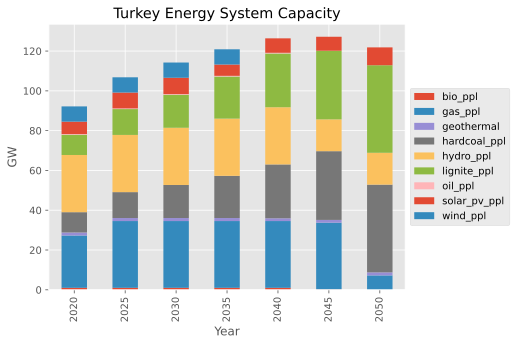
    


    

    


    
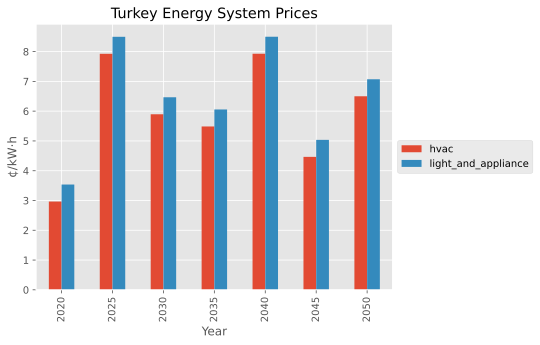
    


    
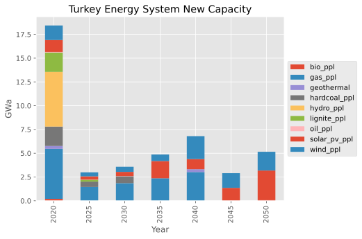
    


    
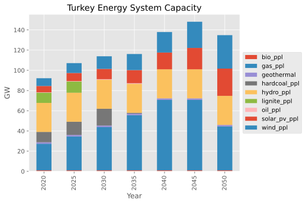
    


    
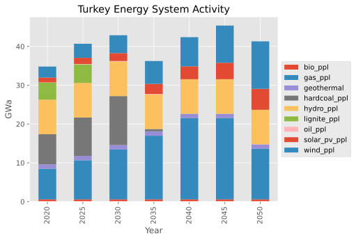
    


    
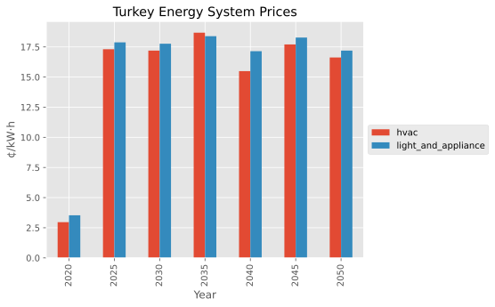
    


```python
print(ctax_rep.get("EMISS"))
```

    n       e    type_tec  y   
    World   CO2  all       2020    147.324000
                           2025    176.007434
                           2030    133.282524
                           2035     53.794878
                           2040     62.144239
                           2045     62.144239
                           2050     38.722729
    Turkey  CO2  all       2020    147.324000
                           2025    176.007434
                           2030    133.282524
                           2035     53.794878
                           2040     62.144239
                           2045     62.144239
                           2050     38.722729
    Name: EMISS, dtype: float64, units: dimensionless


```python
emission = list(ctax_rep.get("EMISS").head(7))
```

# Exercise: Emissions constraint


```python
# Print the index names for one of these
base_scen.idx_names("bound_emission")
```


    ['node', 'type_emission', 'type_tec', 'type_year']


```python
bounds = pd.DataFrame({
    "node": country,
    "type_emission": "GHGs",
    "type_year": horizon,
    "type_tec": "all",
    "value": np.array(emission),
    "unit": 'tCO2', 
})

with solve_modified(base_scen, new_name="emissions_constraint") as emissions_scen:
    emissions_scen.add_par('bound_emission', bounds)
```

    --- Warning: The GAMS version [51.3.0] differs from the API version [24.8.3].
    --- Job MESSAGE_run.gms Start 09/28/26 21:12:14 51.3.0 38407a9b LEX-LEG x86 64bit/Linux
    --- Applying:
        /home/ggungor/Downloads/gams51.3_linux_x64_64_sfx/gmsprmun.txt
    --- GAMS Parameters defined
        Input /home/ggungor/miniconda3/lib/python3.12/site-packages/message_ix/model/MESSAGE_run.gms
        ScrDir /home/ggungor/miniconda3/lib/python3.12/site-packages/message_ix/model/225a/
        SysDir /home/ggungor/Downloads/gams51.3_linux_x64_64_sfx/
        LogOption 4
        LogFile /home/ggungor/miniconda3/lib/python3.12/site-packages/message_ix/model/MESSAGE_run.log
        AppendLog 1
        --in /home/ggungor/miniconda3/lib/python3.12/site-packages/message_ix/model/data/MsgData_Turkey_energy_model_emissions_constraint.gdx
        --out /home/ggungor/miniconda3/lib/python3.12/site-packages/message_ix/model/output/MsgOutput_Turkey_energy_model_emissions_constraint.gdx
        --iter /home/ggungor/miniconda3/lib/python3.12/site-packages/message_ix/model/output/MsgIterationReport_Turkey_energy_model_emissions_constraint.gdx
    Licensee: G?rkem G?ng?r                                  G260118+0003Ac-GEN
              ggungor@mezun.hacettepe.edu.tr                          CLA115848
              /home/ggungor/Downloads/gams51.3_linux_x64_64_sfx/gamslice.txt
              node:60351003 v:2                                                
              Community license for demonstration and instructional purposes only
    System information: 2 physical cores and 4 Gb physical memory detected
    GAMS 51.3.0   Copyright (C) 1987-2025 GAMS Development. All rights reserved
    --- Starting compilation
    --- MESSAGE_run.gms(3) 2 Mb
    --- . copyright.gms(29) 2 Mb
    --- MESSAGE_run.gms(30) 2 Mb
    --- . model_setup.gms(66) 2 Mb
    --- .. auxiliary_settings.gms(37) 2 Mb
    --- . model_setup.gms(69) 2 Mb
    --- .. version.gms(23) 2 Mb
    --- . model_setup.gms(70) 2 Mb
    --- .. version_check.gms(7) 2 Mb
    --- GDXin=/home/ggungor/miniconda3/lib/python3.12/site-packages/message_ix/model/data/MsgData_Turkey_energy_model_emissions_constraint.gdx
    --- GDX File ($gdxIn) /home/ggungor/miniconda3/lib/python3.12/site-packages/message_ix/model/data/MsgData_Turkey_energy_model_emissions_constraint.gdx
    --- .. version_check.gms(24) 3 Mb
    --- . model_setup.gms(73) 3 Mb
    --- .. sets_maps_def.gms(511) 3 Mb
    --- . model_setup.gms(74) 3 Mb
    --- .. parameter_def.gms(907) 3 Mb
    --- . model_setup.gms(77) 3 Mb
    --- .. data_load.gms(9) 3 Mb
    --- GDXin=/home/ggungor/miniconda3/lib/python3.12/site-packages/message_ix/model/data/MsgData_Turkey_energy_model_emissions_constraint.gdx
    --- GDX File ($gdxIn) /home/ggungor/miniconda3/lib/python3.12/site-packages/message_ix/model/data/MsgData_Turkey_energy_model_emissions_constraint.gdx
    --- .. data_load.gms(126) 3 Mb
    --- ... period_parameter_assignment.gms(118) 3 Mb
    --- .. data_load.gms(269) 3 Mb
    --- . model_setup.gms(80) 3 Mb
    --- .. scaling_investment_costs.gms(182) 3 Mb
    --- . model_setup.gms(86) 3 Mb
    --- .. model_core.gms(2339) 3 Mb
    --- . model_setup.gms(86) 3 Mb
    --- MESSAGE_run.gms(36) 3 Mb
    --- . model_solve.gms(109) 3 Mb
    --- .. aux_computation_time.gms(14) 3 Mb
    --- . model_solve.gms(175) 3 Mb
    --- MESSAGE_run.gms(43) 3 Mb
    --- . reporting.gms(26) 3 Mb
    --- MESSAGE_run.gms(52) 3 Mb
    --- Starting execution: elapsed 0:00:00.024
    --- MESSAGE_run.gms(1644) 4 Mb
        +++ Importing data from '/home/ggungor/miniconda3/lib/python3.12/site-packages/message_ix/model/data/MsgData_Turkey_energy_model_emissions_constraint.gdx'... +++
    --- MESSAGE_run.gms(1669) 4 Mb
    --- GDXin=/home/ggungor/miniconda3/lib/python3.12/site-packages/message_ix/model/data/MsgData_Turkey_energy_model_emissions_constraint.gdx
    --- GDX File (execute_load) /home/ggungor/miniconda3/lib/python3.12/site-packages/message_ix/model/data/MsgData_Turkey_energy_model_emissions_constraint.gdx
    --- MESSAGE_run.gms(4570) 4 Mb
        +++ Solve the perfect-foresight version of MESSAGEix +++
    --- Generating LP model MESSAGE_LP
    --- MESSAGE_run.gms(4588) 5 Mb
    ---   767 rows  621 columns  2,659 non-zeroes
    --- Range statistics (absolute non-zero finite values)
    --- RHS       [min, max] : [ 8.037E-02, 1.760E+02] - Zero values observed as well
    --- Bound     [min, max] : [        NA,        NA] - Zero values observed as well
    --- Matrix    [min, max] : [ 1.000E-01, 3.100E+03]
    --- Executing CPLEX (Solvelink=2): elapsed 0:00:00.035
    
    IBM ILOG CPLEX   51.3.0 38407a9b Oct 27, 2025          LEG x86 64bit/Linux    
    
    *** This solver runs with a community license. No commercial use.
    
    Reading parameter(s) from "/home/ggungor/miniconda3/lib/python3.12/site-packages/message_ix/model/cplex.opt"
    >>  advind = 0
    >>  lpmethod = 4
    >>  threads = 4
    >>  epopt = 1e-06
    Finished reading from "/home/ggungor/miniconda3/lib/python3.12/site-packages/message_ix/model/cplex.opt"
    
    --- GMO setup time: 0.00s
    --- Space for names approximately 0.07 Mb
    --- Use option 'names no' to turn use of names off
    --- GMO memory 0.66 Mb (peak 0.66 Mb)
    --- Dictionary memory 0.00 Mb
    --- Cplex 22.1.2.0 link memory 0.02 Mb (peak 0.13 Mb)
    --- Starting Cplex
    
    Version identifier: 22.1.2.0 | 2024-11-26 | 0edbb82fd
    CPXPARAM_Advance                                 0
    CPXPARAM_LPMethod                                4
    CPXPARAM_Threads                                 4
    CPXPARAM_Parallel                                1
    CPXPARAM_MIP_Display                             4
    CPXPARAM_MIP_Pool_Capacity                       0
    CPXPARAM_Barrier_Limits_Iteration                100000000
    CPXPARAM_TimeLimit                               1000000
    CPXPARAM_MIP_Tolerances_AbsMIPGap                0
    CPXPARAM_MIP_Tolerances_MIPGap                   0
    Tried aggregator 1 time.
    LP Presolve eliminated 269 rows and 141 columns.
    Aggregator did 119 substitutions.
    Reduced LP has 378 rows, 411 columns, and 1444 nonzeros.
    Presolve time = 0.00 sec. (0.99 ticks)
    Parallel mode: using up to 4 threads for barrier.
    Number of nonzeros in lower triangle of A*A' = 1369
    Using Approximate Minimum Degree ordering
    Total time for automatic ordering = 0.00 sec. (0.22 ticks)
    Summary statistics for Cholesky factor:
      Threads                   = 4
      Rows in Factor            = 378
      Integer space required    = 861
      Total non-zeros in factor = 5196
      Total FP ops to factor    = 81860
     Itn      Primal Obj        Dual Obj  Prim Inf Upper Inf  Dual Inf Inf Ratio
       0   2.4257860e+06   2.3815682e+05  9.08e+03  8.95e+01  4.65e+03  1.00e+00
       1   2.0358777e+06   2.3942137e+05  7.46e+03  7.35e+01  1.86e+03  1.61e-03
       2   1.5048445e+06   2.6891544e+05  5.19e+03  5.11e+01  8.95e+02  1.59e-03
       3   1.2431795e+06   3.2121078e+05  3.89e+03  3.83e+01  6.53e+02  1.56e-03
       4   9.4280791e+05   3.4234380e+05  2.57e+03  2.54e+01  2.34e+02  2.18e-03
       5   6.7308759e+05   3.8536146e+05  1.29e+03  1.27e+01  6.78e+01  3.15e-03
       6   5.8790628e+05   4.0872303e+05  8.24e+02  8.12e+00  3.71e+01  4.90e-03
       7   5.4753937e+05   4.3382173e+05  5.46e+02  5.38e+00  2.14e+01  6.21e-03
       8   5.2935575e+05   4.4164455e+05  4.33e+02  4.27e+00  1.50e+01  8.09e-03
       9   5.0087303e+05   4.4906050e+05  2.26e+02  2.23e+00  1.10e+01  9.56e-03
      10   4.8822068e+05   4.6048051e+05  1.14e+02  1.12e+00  6.26e+00  1.52e-02
      11   4.8175956e+05   4.6531484e+05  6.34e+01  6.25e-01  3.96e+00  2.39e-02
      12   4.7672799e+05   4.7201695e+05  2.13e+01  2.10e-01  9.66e-01  9.81e-02
      13   4.7505967e+05   4.7291095e+05  6.25e+00  6.16e-02  5.99e-01  1.50e-01
      14   4.7473355e+05   4.7299961e+05  2.38e+00  2.35e-02  5.66e-01  1.63e-01
      15   4.7453861e+05   4.7386763e+05  5.36e-01  5.28e-03  2.34e-01  4.03e-01
      16   4.7444396e+05   4.7424793e+05  5.73e-02  5.65e-04  7.66e-02  1.32e+00
      17   4.7442583e+05   4.7440532e+05  8.77e-03  8.64e-05  7.54e-03  3.58e+01
      18   4.7441165e+05   4.7441163e+05  8.48e-06  8.36e-08  5.18e-06  5.18e+04
      19   4.7441164e+05   4.7441164e+05  9.34e-10  8.56e-12  9.51e-10  3.06e+08
      20   4.7441164e+05   4.7441164e+05  2.10e-11  3.73e-14  1.28e-10  2.89e+12
    Barrier time = 0.02 sec. (3.68 ticks)
    Parallel mode: deterministic, using up to 4 threads for concurrent optimization:
     * Starting dual Simplex on 1 thread...
     * Starting primal Simplex on 1 thread...
    
    Dual crossover.
      Dual:  Fixing 170 variables.
          169 DMoves:  Infeasibility  0.00000000e+00  Objective  4.74411639e+05
            0 DMoves:  Infeasibility  5.68434189e-13  Objective  4.74411639e+05
      Dual:  Pushed 76, exchanged 94.
      Primal:  Fixing 2 variables.
            1 PMoves:  Infeasibility  7.49400542e-15  Objective  4.74411639e+05
            0 PMoves:  Infeasibility  7.49400542e-15  Objective  4.74411639e+05
      Primal:  Pushed 2, exchanged 0.
    
    Dual simplex solved model.
    
    Total crossover time = 0.00 sec. (0.93 ticks)
    
    Total time on 4 threads = 0.02 sec. (5.63 ticks)
    
    --- LP status (1): optimal.
    --- Cplex Time: 0.02sec (det. 5.63 ticks)
    
    
    Optimal solution found
    Objective:       474411.638916
    
    --- Reading solution for model MESSAGE_LP
    --- Executing after solve: elapsed 0:00:00.126
    --- MESSAGE_run.gms(4786) 5 Mb
    --- GDX File (execute_unload) /home/ggungor/miniconda3/lib/python3.12/site-packages/message_ix/model/output/MsgOutput_Turkey_energy_model_emissions_constraint.gdx
    --- MESSAGE_run.gms(4788) 5 Mb
        +++ End of MESSAGEix (stand-alone) run - have a nice day! +++
    *** Status: Normal completion
    --- Job MESSAGE_run.gms Stop 09/28/26 21:12:14 elapsed 0:00:00.199
    --- Warning: The GAMS version [51.3.0] differs from the API version [24.8.3].
    --- Warning: The GAMS version [51.3.0] differs from the API version [24.8.3].


    2026-09-28 21:12:15,077 ERROR at.ac.iiasa.ixmp.objects.Scenario:1691 - variable 'I' not found in gdx!
    2026-09-28 21:12:15,078 ERROR at.ac.iiasa.ixmp.objects.Scenario:1691 - variable 'C' not found in gdx!


```python
# Prepare a Reporter based on the solved scenario
emissions_rep = Reporter.from_scenario(emissions_scen)
prepare_plots(emissions_rep)

# Run the same reporting on both the base and modified scenarios
for r in ctax_rep, emissions_rep:
    r.set_filters(t=plants, c=None)
    r.get("plot new capacity")
    r.get("plot capacity")
    r.get("plot activity")
    r.set_filters(t=None, c=["hvac", "light_and_appliance"])
    r.get("plot prices")
```


    

    


    

    


    

    


    

    


    

    


    

    


    

    


    
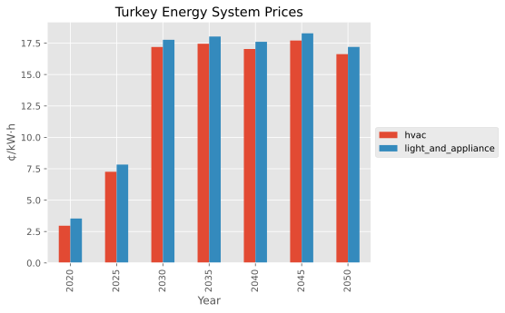
    


```python
mp.close_db()
```


```python

```
