# Turkish power sector Tutorial Part 1: Building an Energy Model

For information on how to install *MESSAGEix*, please refer to [Installation page](https://docs.messageix.org/en/stable/#getting-started), and for getting the *MESSAGEix* tutorials, please follow the steps mentioned in [Tutorials](https://docs.messageix.org/en/stable/tutorials.html). This tutorial is based on the [Austria Energy System](https://docs.messageix.org/en/stable/tutorials.html#austrian-energy-system) tutorial of *MESSAGEix*.

Please refer to the [user guidelines](https://github.com/iiasa/message_ix/blob/master/NOTICE.rst)
for additional information on using *MESSAGEix*, including the recommended citation and how to name new models.

**Pre-requisites**
- You have the *MESSAGEix* framework installed and working

**Structure of these tutorials.** After having run this baseline tutorial, you are able to start with any of the other tutorials, but we recommend to follow the order below for going through the information step-wise:

1. Prepare the base model version (Python: ``turkey_revA.ipynb``
2. Plot the results of the baseline runs (Python: ``turkey_load_scenario.ipynb``
3. Run a single policy scenario (``turkey_single_policy.ipynb``)
4. Run multiple policy scenarios. This tutorial has two notebooks: an introduction with some exercises and completed code for the exercises (exercises: ``austria_multiple_policies.ipynb``)

**Introduction**

In this notebook, we will build a model of the Turkish power sector from scratch. The process will involve defining our model's time horizon and spatial extent, and then populating the model with data associated with model parameters. Once we have a baseline model, we will then move on to investigating policy scenarios.

We will be populating different kinds of parameters including:

### Economic Parameters

- `interestrate`
- `demand`

### Technology Parameters

#### Engineering Parameters

- `input`
- `output`
- `technical_lifetime`
- `capacity_factor`


#### Technoeconomic Parameters

- `inv_cost`
- `fix_cost`
- `var_cost`

### Dynamic Behavior Parameters

- `bound_activity_up`
- `bound_activity_lo`
- `bound_new_capacity_up`
- `initial_activity_up`
- `growth_activity_up`

### Emissions

- `emission_factor`

A full list of parameters can be found in the [MESSAGEix documentation](http://messageix.iiasa.ac.at/model/MESSAGE/parameter_def.html). (If you have cloned the MESSAGEix [Github repository](https://github.com/iiasa/message_ix), the documentation can also be built offline; see `doc/README.md`.) 

## The Final Product

At the completion of this exercise, we will have developed an energy model that is comprised of the below Reference Energy System (RES):

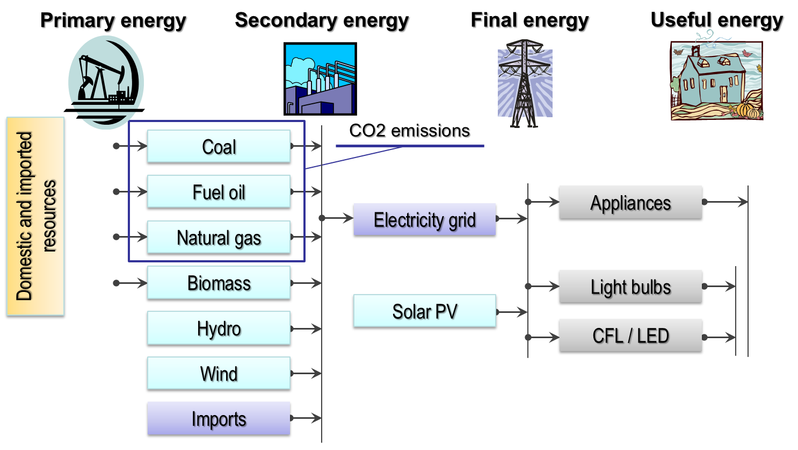


## Setup


```python
# load required packages 
import itertools
import pandas as pd

import matplotlib.pyplot as plt
import matplotlib_inline
%matplotlib inline
matplotlib_inline.backend_inline.set_matplotlib_formats("svg")
plt.style.use('ggplot')

import ixmp as ix
import message_ix

from message_ix.util import make_df
```


```python
# launch the IX modeling platform using the local default database
# mp = ix.Platform(name="default", jvmargs=["-Duser.language=en"])
mp = ix.Platform(name="local")
```

    2026-10-04 13:11:31,888  INFO at.ac.iiasa.ixmp.Platform:165 - Welcome to the IX modeling platform!
    2026-10-04 13:11:31,892  INFO at.ac.iiasa.ixmp.Platform:166 -  connected to database 'jdbc:hsqldb:file:/home/ggungor/.local/share/ixmp/localdb/default' (user: ixmp)...


```python
model = "Turkey energy model"
scen = "baseline"
annot = "developing a stylized energy system model for illustration and testing" 

# We can change the hashtag below with the second line when we are building the model for the first time.
# scenario = message_ix.Scenario(mp, model, scen, version='new', annotation=annot)
scenario = message_ix.Scenario(mp, model, scen, annotation=annot)
```


```python
# We can do a checkout to edit the scenario.
scenario.remove_solution()
scenario.check_out()
```

## Time and Spatial Detail

The model includes the time periods 2020, 2025, 2030, 2035, 2040, 2045 and 2050.


```python
# We remove the hashtags below when we are building the model for the first time
horizon = range(2020, 2053, 5)
# scenario.add_horizon(year=horizon)
```


```python
scenario.vintage_and_active_years()
```


<div>
<style scoped>
    .dataframe tbody tr th:only-of-type {
        vertical-align: middle;
    }

    .dataframe tbody tr th {
        vertical-align: top;
    }

    .dataframe thead th {
        text-align: right;
    }
</style>
<table border="1" class="dataframe">
  <thead>
    <tr style="text-align: right;">
      <th></th>
      <th>year_vtg</th>
      <th>year_act</th>
    </tr>
  </thead>
  <tbody>
    <tr>
      <th>0</th>
      <td>2020</td>
      <td>2020</td>
    </tr>
    <tr>
      <th>1</th>
      <td>2020</td>
      <td>2025</td>
    </tr>
    <tr>
      <th>2</th>
      <td>2020</td>
      <td>2030</td>
    </tr>
    <tr>
      <th>3</th>
      <td>2020</td>
      <td>2035</td>
    </tr>
    <tr>
      <th>4</th>
      <td>2020</td>
      <td>2040</td>
    </tr>
    <tr>
      <th>5</th>
      <td>2020</td>
      <td>2045</td>
    </tr>
    <tr>
      <th>6</th>
      <td>2020</td>
      <td>2050</td>
    </tr>
    <tr>
      <th>7</th>
      <td>2025</td>
      <td>2025</td>
    </tr>
    <tr>
      <th>8</th>
      <td>2025</td>
      <td>2030</td>
    </tr>
    <tr>
      <th>9</th>
      <td>2025</td>
      <td>2035</td>
    </tr>
    <tr>
      <th>10</th>
      <td>2025</td>
      <td>2040</td>
    </tr>
    <tr>
      <th>11</th>
      <td>2025</td>
      <td>2045</td>
    </tr>
    <tr>
      <th>12</th>
      <td>2025</td>
      <td>2050</td>
    </tr>
    <tr>
      <th>13</th>
      <td>2030</td>
      <td>2030</td>
    </tr>
    <tr>
      <th>14</th>
      <td>2030</td>
      <td>2035</td>
    </tr>
    <tr>
      <th>15</th>
      <td>2030</td>
      <td>2040</td>
    </tr>
    <tr>
      <th>16</th>
      <td>2030</td>
      <td>2045</td>
    </tr>
    <tr>
      <th>17</th>
      <td>2030</td>
      <td>2050</td>
    </tr>
    <tr>
      <th>18</th>
      <td>2035</td>
      <td>2035</td>
    </tr>
    <tr>
      <th>19</th>
      <td>2035</td>
      <td>2040</td>
    </tr>
    <tr>
      <th>20</th>
      <td>2035</td>
      <td>2045</td>
    </tr>
    <tr>
      <th>21</th>
      <td>2035</td>
      <td>2050</td>
    </tr>
    <tr>
      <th>22</th>
      <td>2040</td>
      <td>2040</td>
    </tr>
    <tr>
      <th>23</th>
      <td>2040</td>
      <td>2045</td>
    </tr>
    <tr>
      <th>24</th>
      <td>2040</td>
      <td>2050</td>
    </tr>
    <tr>
      <th>25</th>
      <td>2045</td>
      <td>2045</td>
    </tr>
    <tr>
      <th>26</th>
      <td>2045</td>
      <td>2050</td>
    </tr>
    <tr>
      <th>27</th>
      <td>2050</td>
      <td>2050</td>
    </tr>
  </tbody>
</table>
</div>


```python
# We remove the hashtags below when we are building the model for the first time
country = 'Turkey'
scenario.add_spatial_sets({'country': country})
```


```python
scenario.set("node")
```


    0     World
    1    Turkey
    dtype: object


## Model Structure


```python
scenario.add_set("commodity", ["electricity", "light_and_appliance", "hvac"])
scenario.add_set("level", ["secondary", "final", "useful"])
scenario.add_set("mode", "standard")
```


```python
scenario.set("commodity")
```


    0            electricity
    1    light_and_appliance
    2                   hvac
    dtype: object


## Economic Parameters

Definition of the socio-economic discount rate:


```python
scenario.add_par("interestrate", horizon, value=0.1, unit='-')
```

The fundamental premise of the model is to satisfy demand for energy (services). To first order, demands for services (e.g. electricity) track with economic productivity (GDP). Therefore, as a simple example, we define both a GDP profile and a correlation parameter between GDP growth and demand, called beta. Beta will then be used to obtain a simplistic demand profile.

The socio-economic forecasts are taken from the [IIASA SSP](https://data.ece.iiasa.ac.at/ssp/#/downloads) database.


```python
import pyam

# by default, you receive the latest SSP projections (2024 release)
df = pyam.read_iiasa("ssp", region="Turkey", variable="GDP|PPP")
```


    <IPython.core.display.Javascript object>


    pyam - INFO: Running in a notebook, setting up a basic logging at level INFO
    pyam.iiasa - INFO: You are connected to the IXSE_SSP scenario explorer hosted by IIASA. If you use this data in any published format, please cite the data as provided in the explorer guidelines: https://data.ece.iiasa.ac.at/ssp/#/about
    pyam.iiasa - INFO: You are connected as an anonymous user


```python
df.variable
```


    ['GDP|PPP']


```python
df.plot()
```

    /home/ggungor/miniconda3/envs/message_env/lib/python3.8/site-packages/pyam/plotting.py:1073: FutureWarning: iteritems is deprecated and will be removed in a future version. Use .items instead.
      for col, data in df.iteritems():


    <Axes: title={'center': 'region: Turkey - variable: GDP|PPP'}, xlabel='Year', ylabel='billion USD_2017/yr'>


    
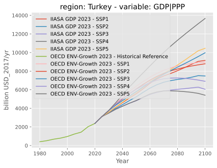
    


```python
gdp = list(df.filter(scenario="SSP5").head(6)['value'])
gdp_base = list([2390])
```

The base year GDP|PPP is taken from [World Bank](https://data.worldbank.org/indicator/NY.GDP.MKTP.PP.CD?locations=TR) database.


```python
gdp = gdp_base + gdp
```


```python
gdp
```


    [2390,
     3109.770705833,
     3579.6073756682,
     4130.31253536009,
     4647.47863642335,
     5173.93920442617,
     5665.4137372932]


```python
gdp = pd.Series(gdp, index=horizon)
beta = 0.7
demand = 1.119 * gdp ** beta
```


```python
demand.head()
```


    2020    259.243942
    2025    311.702255
    2030    343.965482
    2035    380.205266
    2040    412.935545
    dtype: float64


```python
demand.plot()
```


    <Axes: >


    
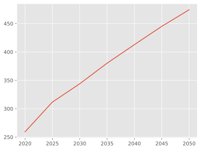
    


## Technologies


```python
plants = [
    "lignite_ppl",
    "hardcoal_ppl", 
    "gas_ppl", 
    "oil_ppl", 
    "bio_ppl", 
    "hydro_ppl",
    "wind_ppl", 
    "geothermal",
    "solar_pv_ppl", # actually primary -> final
]
secondary_energy_techs = plants + ['import']

final_energy_techs = ['electricity_grid']

# lights actually includes lights and household appliances
light_and_appliance = [
    "low_efficiency", 
    "high_efficiency", 
]
useful_energy_techs = light_and_appliance + ['hvac']
```


```python
technologies = secondary_energy_techs + final_energy_techs + useful_energy_techs
scenario.add_set("technology", technologies)
```


```python
scenario.set("technology")
```


    0          lignite_ppl
    1         hardcoal_ppl
    2              gas_ppl
    3              oil_ppl
    4              bio_ppl
    5            hydro_ppl
    6             wind_ppl
    7           geothermal
    8         solar_pv_ppl
    9               import
    10    electricity_grid
    11      low_efficiency
    12     high_efficiency
    13                hvac
    dtype: object


# Electricity consumption by end-uses, 2022

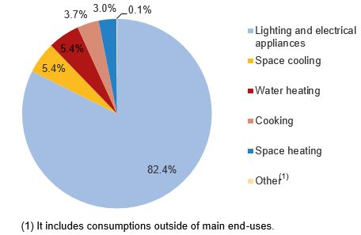
[TURKSTAT Corporate](https://data.tuik.gov.tr/Bulten/Index?p=Final-Energy-Consumption-Statistics-in-Households-2022-53805&dil=2)


```python
demand_per_year = (1-0.824) / 8.76
elec_demand = pd.DataFrame({
        'node': country,
        'commodity': 'hvac',
        'level': 'useful',
        'year': horizon,
        'time': 'year',
        'value': demand_per_year * demand,
        'unit': 'GWa',
    })
scenario.add_par("demand", elec_demand)

demand_per_year = 0.824 / 8.76
light_demand = pd.DataFrame({
        'node': country,
        'commodity': 'light_and_appliance',
        'level': 'useful',
        'year': horizon,
        'time': 'year',
        'value': demand_per_year * demand,
        'unit': 'GWa',
    })
scenario.add_par("demand", light_demand)
```


```python
scenario.par("demand")
```


<div>
<style scoped>
    .dataframe tbody tr th:only-of-type {
        vertical-align: middle;
    }

    .dataframe tbody tr th {
        vertical-align: top;
    }

    .dataframe thead th {
        text-align: right;
    }
</style>
<table border="1" class="dataframe">
  <thead>
    <tr style="text-align: right;">
      <th></th>
      <th>node</th>
      <th>commodity</th>
      <th>level</th>
      <th>year</th>
      <th>time</th>
      <th>value</th>
      <th>unit</th>
    </tr>
  </thead>
  <tbody>
    <tr>
      <th>0</th>
      <td>Turkey</td>
      <td>hvac</td>
      <td>useful</td>
      <td>2020</td>
      <td>year</td>
      <td>5.208554</td>
      <td>GWa</td>
    </tr>
    <tr>
      <th>1</th>
      <td>Turkey</td>
      <td>hvac</td>
      <td>useful</td>
      <td>2025</td>
      <td>year</td>
      <td>6.262511</td>
      <td>GWa</td>
    </tr>
    <tr>
      <th>2</th>
      <td>Turkey</td>
      <td>hvac</td>
      <td>useful</td>
      <td>2030</td>
      <td>year</td>
      <td>6.910722</td>
      <td>GWa</td>
    </tr>
    <tr>
      <th>3</th>
      <td>Turkey</td>
      <td>hvac</td>
      <td>useful</td>
      <td>2035</td>
      <td>year</td>
      <td>7.638827</td>
      <td>GWa</td>
    </tr>
    <tr>
      <th>4</th>
      <td>Turkey</td>
      <td>hvac</td>
      <td>useful</td>
      <td>2040</td>
      <td>year</td>
      <td>8.296422</td>
      <td>GWa</td>
    </tr>
    <tr>
      <th>5</th>
      <td>Turkey</td>
      <td>hvac</td>
      <td>useful</td>
      <td>2045</td>
      <td>year</td>
      <td>8.943625</td>
      <td>GWa</td>
    </tr>
    <tr>
      <th>6</th>
      <td>Turkey</td>
      <td>hvac</td>
      <td>useful</td>
      <td>2050</td>
      <td>year</td>
      <td>9.530173</td>
      <td>GWa</td>
    </tr>
    <tr>
      <th>7</th>
      <td>Turkey</td>
      <td>light_and_appliance</td>
      <td>useful</td>
      <td>2020</td>
      <td>year</td>
      <td>24.385503</td>
      <td>GWa</td>
    </tr>
    <tr>
      <th>8</th>
      <td>Turkey</td>
      <td>light_and_appliance</td>
      <td>useful</td>
      <td>2025</td>
      <td>year</td>
      <td>29.319938</td>
      <td>GWa</td>
    </tr>
    <tr>
      <th>9</th>
      <td>Turkey</td>
      <td>light_and_appliance</td>
      <td>useful</td>
      <td>2030</td>
      <td>year</td>
      <td>32.354744</td>
      <td>GWa</td>
    </tr>
    <tr>
      <th>10</th>
      <td>Turkey</td>
      <td>light_and_appliance</td>
      <td>useful</td>
      <td>2035</td>
      <td>year</td>
      <td>35.763600</td>
      <td>GWa</td>
    </tr>
    <tr>
      <th>11</th>
      <td>Turkey</td>
      <td>light_and_appliance</td>
      <td>useful</td>
      <td>2040</td>
      <td>year</td>
      <td>38.842339</td>
      <td>GWa</td>
    </tr>
    <tr>
      <th>12</th>
      <td>Turkey</td>
      <td>light_and_appliance</td>
      <td>useful</td>
      <td>2045</td>
      <td>year</td>
      <td>41.872425</td>
      <td>GWa</td>
    </tr>
    <tr>
      <th>13</th>
      <td>Turkey</td>
      <td>light_and_appliance</td>
      <td>useful</td>
      <td>2050</td>
      <td>year</td>
      <td>44.618538</td>
      <td>GWa</td>
    </tr>
  </tbody>
</table>
</div>


### Engineering Parameters


```python
year_df = scenario.vintage_and_active_years()
vintage_years, act_years = year_df['year_vtg'], year_df['year_act']
```


```python
base_input = {
    'node_loc': country,
    'year_vtg': vintage_years,
    'year_act': act_years,
    'mode': 'standard',
    'node_origin': country,
    'commodity': 'electricity',
    'time': 'year',
    'time_origin': 'year',
}

grid = pd.DataFrame(dict(
        technology = 'electricity_grid',
        level = 'secondary',
        value = 1.0,
        unit = '-',
        **base_input
        ))
scenario.add_par("input", grid)


low_efficiency = pd.DataFrame(dict(
        technology = 'low_efficiency',
        level = 'final',
        value = 1.0,
        unit = '-',
        **base_input
        ))
scenario.add_par("input", low_efficiency)

high_efficiency = pd.DataFrame(dict(
        technology = 'high_efficiency',
        level = 'final',
        value = 0.3, # LED and CFL lighting equipment are more efficient than conventional light bulbs,
                     #so they need less input electricity to produce the same quantity of 'light'
                     #compared to conventional light bulbs (0.3 units vs 1.0, respectively) 
        unit = '-',
        **base_input
        ))
scenario.add_par("input", high_efficiency)

hvac = pd.DataFrame(dict(
        technology = 'hvac',
        level = 'final',
        value = 1.0,
        unit = '-',
        **base_input
        ))
scenario.add_par("input", hvac)
```


```python
base_output = {
    'node_loc': country,
    'year_vtg': vintage_years,
    'year_act': act_years,
    'mode': 'standard',
    'node_dest': country,
    'time': 'year',
    'time_dest': 'year', 
    'unit': '-',
}

imports = make_df(base_output, technology='import', commodity='electricity', 
                  level='secondary', value=1.)
scenario.add_par('output', imports)

grid = make_df(base_output, technology='electricity_grid', commodity='electricity', 
               level='final', value=.85)
scenario.add_par('output', grid)

low_efficiency = make_df(base_output, technology='low_efficiency', commodity='light_and_appliance', 
               level='useful', value=1.)
scenario.add_par('output', low_efficiency)

high_efficiency = make_df(base_output, technology='high_efficiency', commodity='light_and_appliance', 
              level='useful', value=1.)
scenario.add_par('output', high_efficiency)

hvac = make_df(base_output, technology='hvac', commodity='hvac', 
              level='useful', value=1.)
scenario.add_par('output', hvac)

hardcoal = make_df(base_output, technology='hardcoal_ppl', commodity='electricity', 
               level='secondary', value=1.)
scenario.add_par('output', hardcoal)

lignite = make_df(base_output, technology='lignite_ppl', commodity='electricity', 
               level='secondary', value=1.)
scenario.add_par('output', lignite)

gas = make_df(base_output, technology='gas_ppl', commodity='electricity', 
              level='secondary', value=1.)
scenario.add_par('output', gas)

oil = make_df(base_output, technology='oil_ppl', commodity='electricity', 
              level='secondary', value=1.)
scenario.add_par('output', oil)

bio = make_df(base_output, technology='bio_ppl', commodity='electricity', 
              level='secondary', value=1.)
scenario.add_par('output', bio)

hydro = make_df(base_output, technology='hydro_ppl', commodity='electricity', 
                level='secondary', value=1.)
scenario.add_par('output', hydro)

wind = make_df(base_output, technology='wind_ppl', commodity='electricity', 
               level='secondary', value=1.)
scenario.add_par('output', wind)

solar_pv = make_df(base_output, technology='solar_pv_ppl', commodity='electricity', 
                   level='final', value=1.)
scenario.add_par('output', solar_pv)

geothermal = make_df(base_output, technology='geothermal', commodity='electricity', 
                   level='final', value=1.)
scenario.add_par('output', geothermal)
```


```python
base_technical_lifetime = {
    'node_loc': country,
    'year_vtg': horizon,
    'unit': 'y',
}

lifetimes = {
    'lignite_ppl':40,
    'hardcoal_ppl': 40,
    'gas_ppl': 30,
    'oil_ppl': 30,
    'bio_ppl': 30,
    'hydro_ppl': 60,
    'wind_ppl': 20,
    'solar_pv_ppl': 15,
    'geothermal':20,
    'low_efficiency': 1,
    'high_efficiency': 10,
}

for tec, val in lifetimes.items():
    df = make_df(base_technical_lifetime, technology=tec, value=val)
    scenario.add_par('technical_lifetime', df)
```

# Turkey Energy Balance Tables
The capacity factors are calculated by dividing the electricity generation of technologies to their installed capacities in 2020.
[World Energy Council Turkey](https://dunyaenerji.org.tr/turkiye-enerji-denge-tablolari/)


```python
base_capacity_factor = {
    'node_loc': country,
    'year_vtg': vintage_years,
    'year_act': act_years,
    'time': 'year',
    'unit': '-',
}

capacity_factor = {
    'lignite_ppl': 0.43,
    'hardcoal_ppl': 0.76,
    'gas_ppl': 0.30,
    'oil_ppl': 0.24,
    'bio_ppl': 0.58,
    'hydro_ppl': 0.31,
    'wind_ppl': 0.37,
    'geothermal': 0.75,
    'solar_pv_ppl': 0.20,
    'low_efficiency': 0.1,
    'high_efficiency': 0.1,
}

for tec, val in capacity_factor.items():
    df = make_df(base_capacity_factor, technology=tec, value=val)
    scenario.add_par('capacity_factor', df)
```

### Technoeconomic Parameters

The costs are included from [MESSAGE-ix-GLOBIOM R11 baseline energy model](https://doi.org/10.5281/zenodo.5793870) database for ```R11_MEA``` region.


```python
base_inv_cost = {
    'node_loc': country,
    'year_vtg': horizon,
    'unit': 'USD/kW',
}

# Adding a new unit to the library
mp.add_unit('USD/kW')    

# in $ / kW (specific investment cost)
# from MESSAGEix-GLOBIOM R11 Baseline energy model database
# Assume the cost of lignite_ppl is half of hardcoal_ppl
costs = {
    'lignite_ppl': 526.34,
    'hardcoal_ppl': 1052.67,
    'gas_ppl':  739.18,
    'oil_ppl':  500,
    'hydro_ppl': 2753.14,
    'bio_ppl':  1862.42,
    'wind_ppl': 1767,
    'geothermal': 3100.47,
    'solar_pv_ppl': 1025,
    'low_efficiency': 5,
    'high_efficiency':  900, 
}

for tec, val in costs.items():
    df = make_df(base_inv_cost, technology=tec, value=val)
    scenario.add_par('inv_cost', df)
```


```python
base_fix_cost = {
    'node_loc': country,
    'year_vtg': vintage_years,
    'year_act': act_years,
    'unit': 'USD/kWa',
}

# Adding a new unit to the library
mp.add_unit('USD/kWa')  

# in $ / kW / year (every year a fixed quantity is destinated to cover part of the O&M costs
# based on the size of the plant, e.g. lighting, labor, scheduled maintenance, etc.)

costs = {
    'lignite_ppl': 36.44,
    'hardcoal_ppl': 36.44,
    'gas_ppl':  25.67,
    'oil_ppl':  28,
    'hydro_ppl': 52.63,
    'bio_ppl':  64.78,
    'wind_ppl': 40.06,
    'solar_pv_ppl': 6.52,
    'geothermal': 157.75,
}

for tec, val in costs.items():
    df = make_df(base_fix_cost, technology=tec, value=val)
    scenario.add_par('fix_cost', df)
```


```python
base_var_cost = {
    'node_loc': country,
    'year_vtg': vintage_years,
    'year_act': act_years,
    'mode': 'standard',
    'time': 'year',
    'unit': 'USD/kWa',
}

# Variable O&M (costs associated with the degradation of equipment when the plant is functioning
# per unit of energy produced)
# kWa = kW·year = 8760 kWh. Therefore this costs represents USD per 8760 kWh of energy.
# Do not confuse with fixed O&M units.


#var O&M in $ / MWh 
costs = {
    'electricity_grid': 25.2,
}

for tec, val in costs.items():
    df = make_df(base_var_cost, technology=tec, value=val * 8760. / 1e3) # to convert it into USD/kWa
    scenario.add_par('var_cost', df)
```

## Dynamic Behavior Parameters

In this section the following parameters will be added to the different technologies:
- `bound_activity_up`
- `bound_activity_lo`
- `bound_new_capacity_up`
- `growth_activity_up`

As stated in the **Introduction**, a full list of parameters can be found in the *MESSAGEix* documentation. Specifically for this list, please refer to the section [Bounds on capacity and activity](https://docs.messageix.org/en/stable/model/MESSAGE/parameter_def.html#bounds-on-capacity-and-activity).


```python
base_growth = {
    'node_loc': country,
    'year_act': horizon[1:],
    'value': 0.05,
    'time': 'year',
    'unit': '%',
}

growth_technologies = [
    'lignite_ppl',
    'hardcoal_ppl',
    'gas_ppl',
    'oil_ppl',
    'hydro_ppl',
    'bio_ppl',
    'wind_ppl',
    'solar_pv_ppl',
    'geothermal',
    'import',
    'low_efficiency',
]

for tec in growth_technologies:
    df = make_df(base_growth, technology=tec)
    scenario.add_par('growth_activity_up', df)
```


```python
base_activity = {
    'node_loc': country,
    'year_act': [2020],
    'mode': 'standard',
    'time': 'year',
    'unit': 'GWa',
}

# in GWh - from Turkey Energy Balance Table 2020
activity = {
    'lignite_ppl': 38349,
    'hardcoal_ppl': 67917,
    'gas_ppl':  69090,
    'oil_ppl':  704,
    'hydro_ppl': 78057,
    'bio_ppl':  5136,
    'wind_ppl': 24812,
    'solar_pv_ppl': 10941,
    'geothermal': 9942,
    'import': 6059,
    'high_efficiency': 0,
}

#MODEL CALIBRATION: by inserting an upper and lower bound to the same quantity we are ensuring
#that the model is calibrated at that value that year, so we are at the right starting point.
for tec, val in activity.items():
    df = make_df(base_activity, technology=tec, value=val / 8760.)
    scenario.add_par('bound_activity_up', df)
    scenario.add_par('bound_activity_lo', df)
```


```python
scenario.par("bound_activity_up")
```


<div>
<style scoped>
    .dataframe tbody tr th:only-of-type {
        vertical-align: middle;
    }

    .dataframe tbody tr th {
        vertical-align: top;
    }

    .dataframe thead th {
        text-align: right;
    }
</style>
<table border="1" class="dataframe">
  <thead>
    <tr style="text-align: right;">
      <th></th>
      <th>node_loc</th>
      <th>technology</th>
      <th>year_act</th>
      <th>mode</th>
      <th>time</th>
      <th>value</th>
      <th>unit</th>
    </tr>
  </thead>
  <tbody>
    <tr>
      <th>0</th>
      <td>Turkey</td>
      <td>lignite_ppl</td>
      <td>2020</td>
      <td>standard</td>
      <td>year</td>
      <td>4.377740</td>
      <td>GWa</td>
    </tr>
    <tr>
      <th>1</th>
      <td>Turkey</td>
      <td>hardcoal_ppl</td>
      <td>2020</td>
      <td>standard</td>
      <td>year</td>
      <td>7.753082</td>
      <td>GWa</td>
    </tr>
    <tr>
      <th>2</th>
      <td>Turkey</td>
      <td>gas_ppl</td>
      <td>2020</td>
      <td>standard</td>
      <td>year</td>
      <td>7.886986</td>
      <td>GWa</td>
    </tr>
    <tr>
      <th>3</th>
      <td>Turkey</td>
      <td>oil_ppl</td>
      <td>2020</td>
      <td>standard</td>
      <td>year</td>
      <td>0.080365</td>
      <td>GWa</td>
    </tr>
    <tr>
      <th>4</th>
      <td>Turkey</td>
      <td>hydro_ppl</td>
      <td>2020</td>
      <td>standard</td>
      <td>year</td>
      <td>8.910616</td>
      <td>GWa</td>
    </tr>
    <tr>
      <th>5</th>
      <td>Turkey</td>
      <td>bio_ppl</td>
      <td>2020</td>
      <td>standard</td>
      <td>year</td>
      <td>0.586301</td>
      <td>GWa</td>
    </tr>
    <tr>
      <th>6</th>
      <td>Turkey</td>
      <td>wind_ppl</td>
      <td>2020</td>
      <td>standard</td>
      <td>year</td>
      <td>2.832420</td>
      <td>GWa</td>
    </tr>
    <tr>
      <th>7</th>
      <td>Turkey</td>
      <td>solar_pv_ppl</td>
      <td>2020</td>
      <td>standard</td>
      <td>year</td>
      <td>1.248973</td>
      <td>GWa</td>
    </tr>
    <tr>
      <th>8</th>
      <td>Turkey</td>
      <td>geothermal</td>
      <td>2020</td>
      <td>standard</td>
      <td>year</td>
      <td>1.134932</td>
      <td>GWa</td>
    </tr>
    <tr>
      <th>9</th>
      <td>Turkey</td>
      <td>import</td>
      <td>2020</td>
      <td>standard</td>
      <td>year</td>
      <td>0.691667</td>
      <td>GWa</td>
    </tr>
    <tr>
      <th>10</th>
      <td>Turkey</td>
      <td>high_efficiency</td>
      <td>2020</td>
      <td>standard</td>
      <td>year</td>
      <td>0.000000</td>
      <td>GWa</td>
    </tr>
    <tr>
      <th>11</th>
      <td>Turkey</td>
      <td>hydro_ppl</td>
      <td>2025</td>
      <td>standard</td>
      <td>year</td>
      <td>8.910616</td>
      <td>GWa</td>
    </tr>
    <tr>
      <th>12</th>
      <td>Turkey</td>
      <td>hydro_ppl</td>
      <td>2030</td>
      <td>standard</td>
      <td>year</td>
      <td>8.910616</td>
      <td>GWa</td>
    </tr>
    <tr>
      <th>13</th>
      <td>Turkey</td>
      <td>hydro_ppl</td>
      <td>2035</td>
      <td>standard</td>
      <td>year</td>
      <td>8.910616</td>
      <td>GWa</td>
    </tr>
    <tr>
      <th>14</th>
      <td>Turkey</td>
      <td>hydro_ppl</td>
      <td>2040</td>
      <td>standard</td>
      <td>year</td>
      <td>8.910616</td>
      <td>GWa</td>
    </tr>
    <tr>
      <th>15</th>
      <td>Turkey</td>
      <td>hydro_ppl</td>
      <td>2045</td>
      <td>standard</td>
      <td>year</td>
      <td>8.910616</td>
      <td>GWa</td>
    </tr>
    <tr>
      <th>16</th>
      <td>Turkey</td>
      <td>hydro_ppl</td>
      <td>2050</td>
      <td>standard</td>
      <td>year</td>
      <td>8.910616</td>
      <td>GWa</td>
    </tr>
    <tr>
      <th>17</th>
      <td>Turkey</td>
      <td>bio_ppl</td>
      <td>2025</td>
      <td>standard</td>
      <td>year</td>
      <td>0.586301</td>
      <td>GWa</td>
    </tr>
    <tr>
      <th>18</th>
      <td>Turkey</td>
      <td>bio_ppl</td>
      <td>2030</td>
      <td>standard</td>
      <td>year</td>
      <td>0.586301</td>
      <td>GWa</td>
    </tr>
    <tr>
      <th>19</th>
      <td>Turkey</td>
      <td>bio_ppl</td>
      <td>2035</td>
      <td>standard</td>
      <td>year</td>
      <td>0.586301</td>
      <td>GWa</td>
    </tr>
    <tr>
      <th>20</th>
      <td>Turkey</td>
      <td>bio_ppl</td>
      <td>2040</td>
      <td>standard</td>
      <td>year</td>
      <td>0.586301</td>
      <td>GWa</td>
    </tr>
    <tr>
      <th>21</th>
      <td>Turkey</td>
      <td>bio_ppl</td>
      <td>2045</td>
      <td>standard</td>
      <td>year</td>
      <td>0.586301</td>
      <td>GWa</td>
    </tr>
    <tr>
      <th>22</th>
      <td>Turkey</td>
      <td>bio_ppl</td>
      <td>2050</td>
      <td>standard</td>
      <td>year</td>
      <td>0.586301</td>
      <td>GWa</td>
    </tr>
    <tr>
      <th>23</th>
      <td>Turkey</td>
      <td>import</td>
      <td>2025</td>
      <td>standard</td>
      <td>year</td>
      <td>0.691667</td>
      <td>GWa</td>
    </tr>
    <tr>
      <th>24</th>
      <td>Turkey</td>
      <td>import</td>
      <td>2030</td>
      <td>standard</td>
      <td>year</td>
      <td>0.691667</td>
      <td>GWa</td>
    </tr>
    <tr>
      <th>25</th>
      <td>Turkey</td>
      <td>import</td>
      <td>2035</td>
      <td>standard</td>
      <td>year</td>
      <td>0.691667</td>
      <td>GWa</td>
    </tr>
    <tr>
      <th>26</th>
      <td>Turkey</td>
      <td>import</td>
      <td>2040</td>
      <td>standard</td>
      <td>year</td>
      <td>0.691667</td>
      <td>GWa</td>
    </tr>
    <tr>
      <th>27</th>
      <td>Turkey</td>
      <td>import</td>
      <td>2045</td>
      <td>standard</td>
      <td>year</td>
      <td>0.691667</td>
      <td>GWa</td>
    </tr>
    <tr>
      <th>28</th>
      <td>Turkey</td>
      <td>import</td>
      <td>2050</td>
      <td>standard</td>
      <td>year</td>
      <td>0.691667</td>
      <td>GWa</td>
    </tr>
    <tr>
      <th>29</th>
      <td>Turkey</td>
      <td>geothermal</td>
      <td>2025</td>
      <td>standard</td>
      <td>year</td>
      <td>1.134932</td>
      <td>GWa</td>
    </tr>
    <tr>
      <th>30</th>
      <td>Turkey</td>
      <td>geothermal</td>
      <td>2030</td>
      <td>standard</td>
      <td>year</td>
      <td>1.134932</td>
      <td>GWa</td>
    </tr>
    <tr>
      <th>31</th>
      <td>Turkey</td>
      <td>geothermal</td>
      <td>2035</td>
      <td>standard</td>
      <td>year</td>
      <td>1.134932</td>
      <td>GWa</td>
    </tr>
    <tr>
      <th>32</th>
      <td>Turkey</td>
      <td>geothermal</td>
      <td>2040</td>
      <td>standard</td>
      <td>year</td>
      <td>1.134932</td>
      <td>GWa</td>
    </tr>
    <tr>
      <th>33</th>
      <td>Turkey</td>
      <td>geothermal</td>
      <td>2045</td>
      <td>standard</td>
      <td>year</td>
      <td>1.134932</td>
      <td>GWa</td>
    </tr>
    <tr>
      <th>34</th>
      <td>Turkey</td>
      <td>geothermal</td>
      <td>2050</td>
      <td>standard</td>
      <td>year</td>
      <td>1.134932</td>
      <td>GWa</td>
    </tr>
  </tbody>
</table>
</div>


```python
base_capacity = {
    'node_loc': country,
    'year_vtg': [2020],
    'unit': 'GW',
}

cf = pd.Series(capacity_factor)
act = pd.Series(activity)
capacity = (act / 8760 / cf ).dropna().to_dict()

for tec, val in capacity.items():
    df = make_df(base_capacity, technology=tec, value=val)
    scenario.add_par('bound_new_capacity_up', df)
```


```python
scenario.par("bound_new_capacity_up")
```


<div>
<style scoped>
    .dataframe tbody tr th:only-of-type {
        vertical-align: middle;
    }

    .dataframe tbody tr th {
        vertical-align: top;
    }

    .dataframe thead th {
        text-align: right;
    }
</style>
<table border="1" class="dataframe">
  <thead>
    <tr style="text-align: right;">
      <th></th>
      <th>node_loc</th>
      <th>technology</th>
      <th>year_vtg</th>
      <th>value</th>
      <th>unit</th>
    </tr>
  </thead>
  <tbody>
    <tr>
      <th>0</th>
      <td>Turkey</td>
      <td>bio_ppl</td>
      <td>2020</td>
      <td>1.010864</td>
      <td>GW</td>
    </tr>
    <tr>
      <th>1</th>
      <td>Turkey</td>
      <td>gas_ppl</td>
      <td>2020</td>
      <td>26.289954</td>
      <td>GW</td>
    </tr>
    <tr>
      <th>2</th>
      <td>Turkey</td>
      <td>geothermal</td>
      <td>2020</td>
      <td>1.513242</td>
      <td>GW</td>
    </tr>
    <tr>
      <th>3</th>
      <td>Turkey</td>
      <td>hardcoal_ppl</td>
      <td>2020</td>
      <td>10.201424</td>
      <td>GW</td>
    </tr>
    <tr>
      <th>4</th>
      <td>Turkey</td>
      <td>high_efficiency</td>
      <td>2020</td>
      <td>0.000000</td>
      <td>GW</td>
    </tr>
    <tr>
      <th>5</th>
      <td>Turkey</td>
      <td>hydro_ppl</td>
      <td>2020</td>
      <td>28.743924</td>
      <td>GW</td>
    </tr>
    <tr>
      <th>6</th>
      <td>Turkey</td>
      <td>lignite_ppl</td>
      <td>2020</td>
      <td>10.180790</td>
      <td>GW</td>
    </tr>
    <tr>
      <th>7</th>
      <td>Turkey</td>
      <td>oil_ppl</td>
      <td>2020</td>
      <td>0.334855</td>
      <td>GW</td>
    </tr>
    <tr>
      <th>8</th>
      <td>Turkey</td>
      <td>solar_pv_ppl</td>
      <td>2020</td>
      <td>6.244863</td>
      <td>GW</td>
    </tr>
    <tr>
      <th>9</th>
      <td>Turkey</td>
      <td>wind_ppl</td>
      <td>2020</td>
      <td>7.655189</td>
      <td>GW</td>
    </tr>
  </tbody>
</table>
</div>


```python
base_activity = {
    'node_loc': country,
    'year_act': horizon[1:],
    'mode': 'standard',
    'time': 'year',
    'unit': 'GWa',
}

# in GWh - base value from Turkey Energy Balance Table 2020
keep_activity = {
    'hydro_ppl': 78057,
    'bio_ppl':  5136,
    'import': 6059,
    'geothermal': 9942,
}

for tec, val in keep_activity.items():
    df = make_df(base_activity, technology=tec, value=val / 8760.)
    scenario.add_par('bound_activity_up', df)
```


```python
scenario.par("bound_activity_up")
```


<div>
<style scoped>
    .dataframe tbody tr th:only-of-type {
        vertical-align: middle;
    }

    .dataframe tbody tr th {
        vertical-align: top;
    }

    .dataframe thead th {
        text-align: right;
    }
</style>
<table border="1" class="dataframe">
  <thead>
    <tr style="text-align: right;">
      <th></th>
      <th>node_loc</th>
      <th>technology</th>
      <th>year_act</th>
      <th>mode</th>
      <th>time</th>
      <th>value</th>
      <th>unit</th>
    </tr>
  </thead>
  <tbody>
    <tr>
      <th>0</th>
      <td>Turkey</td>
      <td>lignite_ppl</td>
      <td>2020</td>
      <td>standard</td>
      <td>year</td>
      <td>4.377740</td>
      <td>GWa</td>
    </tr>
    <tr>
      <th>1</th>
      <td>Turkey</td>
      <td>hardcoal_ppl</td>
      <td>2020</td>
      <td>standard</td>
      <td>year</td>
      <td>7.753082</td>
      <td>GWa</td>
    </tr>
    <tr>
      <th>2</th>
      <td>Turkey</td>
      <td>gas_ppl</td>
      <td>2020</td>
      <td>standard</td>
      <td>year</td>
      <td>7.886986</td>
      <td>GWa</td>
    </tr>
    <tr>
      <th>3</th>
      <td>Turkey</td>
      <td>oil_ppl</td>
      <td>2020</td>
      <td>standard</td>
      <td>year</td>
      <td>0.080365</td>
      <td>GWa</td>
    </tr>
    <tr>
      <th>4</th>
      <td>Turkey</td>
      <td>hydro_ppl</td>
      <td>2020</td>
      <td>standard</td>
      <td>year</td>
      <td>8.910616</td>
      <td>GWa</td>
    </tr>
    <tr>
      <th>5</th>
      <td>Turkey</td>
      <td>bio_ppl</td>
      <td>2020</td>
      <td>standard</td>
      <td>year</td>
      <td>0.586301</td>
      <td>GWa</td>
    </tr>
    <tr>
      <th>6</th>
      <td>Turkey</td>
      <td>wind_ppl</td>
      <td>2020</td>
      <td>standard</td>
      <td>year</td>
      <td>2.832420</td>
      <td>GWa</td>
    </tr>
    <tr>
      <th>7</th>
      <td>Turkey</td>
      <td>solar_pv_ppl</td>
      <td>2020</td>
      <td>standard</td>
      <td>year</td>
      <td>1.248973</td>
      <td>GWa</td>
    </tr>
    <tr>
      <th>8</th>
      <td>Turkey</td>
      <td>geothermal</td>
      <td>2020</td>
      <td>standard</td>
      <td>year</td>
      <td>1.134932</td>
      <td>GWa</td>
    </tr>
    <tr>
      <th>9</th>
      <td>Turkey</td>
      <td>import</td>
      <td>2020</td>
      <td>standard</td>
      <td>year</td>
      <td>0.691667</td>
      <td>GWa</td>
    </tr>
    <tr>
      <th>10</th>
      <td>Turkey</td>
      <td>high_efficiency</td>
      <td>2020</td>
      <td>standard</td>
      <td>year</td>
      <td>0.000000</td>
      <td>GWa</td>
    </tr>
    <tr>
      <th>11</th>
      <td>Turkey</td>
      <td>hydro_ppl</td>
      <td>2025</td>
      <td>standard</td>
      <td>year</td>
      <td>8.910616</td>
      <td>GWa</td>
    </tr>
    <tr>
      <th>12</th>
      <td>Turkey</td>
      <td>hydro_ppl</td>
      <td>2030</td>
      <td>standard</td>
      <td>year</td>
      <td>8.910616</td>
      <td>GWa</td>
    </tr>
    <tr>
      <th>13</th>
      <td>Turkey</td>
      <td>hydro_ppl</td>
      <td>2035</td>
      <td>standard</td>
      <td>year</td>
      <td>8.910616</td>
      <td>GWa</td>
    </tr>
    <tr>
      <th>14</th>
      <td>Turkey</td>
      <td>hydro_ppl</td>
      <td>2040</td>
      <td>standard</td>
      <td>year</td>
      <td>8.910616</td>
      <td>GWa</td>
    </tr>
    <tr>
      <th>15</th>
      <td>Turkey</td>
      <td>hydro_ppl</td>
      <td>2045</td>
      <td>standard</td>
      <td>year</td>
      <td>8.910616</td>
      <td>GWa</td>
    </tr>
    <tr>
      <th>16</th>
      <td>Turkey</td>
      <td>hydro_ppl</td>
      <td>2050</td>
      <td>standard</td>
      <td>year</td>
      <td>8.910616</td>
      <td>GWa</td>
    </tr>
    <tr>
      <th>17</th>
      <td>Turkey</td>
      <td>bio_ppl</td>
      <td>2025</td>
      <td>standard</td>
      <td>year</td>
      <td>0.586301</td>
      <td>GWa</td>
    </tr>
    <tr>
      <th>18</th>
      <td>Turkey</td>
      <td>bio_ppl</td>
      <td>2030</td>
      <td>standard</td>
      <td>year</td>
      <td>0.586301</td>
      <td>GWa</td>
    </tr>
    <tr>
      <th>19</th>
      <td>Turkey</td>
      <td>bio_ppl</td>
      <td>2035</td>
      <td>standard</td>
      <td>year</td>
      <td>0.586301</td>
      <td>GWa</td>
    </tr>
    <tr>
      <th>20</th>
      <td>Turkey</td>
      <td>bio_ppl</td>
      <td>2040</td>
      <td>standard</td>
      <td>year</td>
      <td>0.586301</td>
      <td>GWa</td>
    </tr>
    <tr>
      <th>21</th>
      <td>Turkey</td>
      <td>bio_ppl</td>
      <td>2045</td>
      <td>standard</td>
      <td>year</td>
      <td>0.586301</td>
      <td>GWa</td>
    </tr>
    <tr>
      <th>22</th>
      <td>Turkey</td>
      <td>bio_ppl</td>
      <td>2050</td>
      <td>standard</td>
      <td>year</td>
      <td>0.586301</td>
      <td>GWa</td>
    </tr>
    <tr>
      <th>23</th>
      <td>Turkey</td>
      <td>import</td>
      <td>2025</td>
      <td>standard</td>
      <td>year</td>
      <td>0.691667</td>
      <td>GWa</td>
    </tr>
    <tr>
      <th>24</th>
      <td>Turkey</td>
      <td>import</td>
      <td>2030</td>
      <td>standard</td>
      <td>year</td>
      <td>0.691667</td>
      <td>GWa</td>
    </tr>
    <tr>
      <th>25</th>
      <td>Turkey</td>
      <td>import</td>
      <td>2035</td>
      <td>standard</td>
      <td>year</td>
      <td>0.691667</td>
      <td>GWa</td>
    </tr>
    <tr>
      <th>26</th>
      <td>Turkey</td>
      <td>import</td>
      <td>2040</td>
      <td>standard</td>
      <td>year</td>
      <td>0.691667</td>
      <td>GWa</td>
    </tr>
    <tr>
      <th>27</th>
      <td>Turkey</td>
      <td>import</td>
      <td>2045</td>
      <td>standard</td>
      <td>year</td>
      <td>0.691667</td>
      <td>GWa</td>
    </tr>
    <tr>
      <th>28</th>
      <td>Turkey</td>
      <td>import</td>
      <td>2050</td>
      <td>standard</td>
      <td>year</td>
      <td>0.691667</td>
      <td>GWa</td>
    </tr>
    <tr>
      <th>29</th>
      <td>Turkey</td>
      <td>geothermal</td>
      <td>2025</td>
      <td>standard</td>
      <td>year</td>
      <td>1.134932</td>
      <td>GWa</td>
    </tr>
    <tr>
      <th>30</th>
      <td>Turkey</td>
      <td>geothermal</td>
      <td>2030</td>
      <td>standard</td>
      <td>year</td>
      <td>1.134932</td>
      <td>GWa</td>
    </tr>
    <tr>
      <th>31</th>
      <td>Turkey</td>
      <td>geothermal</td>
      <td>2035</td>
      <td>standard</td>
      <td>year</td>
      <td>1.134932</td>
      <td>GWa</td>
    </tr>
    <tr>
      <th>32</th>
      <td>Turkey</td>
      <td>geothermal</td>
      <td>2040</td>
      <td>standard</td>
      <td>year</td>
      <td>1.134932</td>
      <td>GWa</td>
    </tr>
    <tr>
      <th>33</th>
      <td>Turkey</td>
      <td>geothermal</td>
      <td>2045</td>
      <td>standard</td>
      <td>year</td>
      <td>1.134932</td>
      <td>GWa</td>
    </tr>
    <tr>
      <th>34</th>
      <td>Turkey</td>
      <td>geothermal</td>
      <td>2050</td>
      <td>standard</td>
      <td>year</td>
      <td>1.134932</td>
      <td>GWa</td>
    </tr>
  </tbody>
</table>
</div>


## Emissions


```python
scenario.add_set('emission', 'CO2')
scenario.add_cat('emission', 'GHGs', 'CO2')
```


```python
base_emissions = {
    'node_loc': country,
    'year_vtg': vintage_years,
    'year_act': act_years,
    'mode': 'standard',
    'unit': 'tCO2/kWa',
}

# adding new units to the model library (needed only once)
mp.add_unit('tCO2/kWa')
mp.add_unit('MtCO2')

# Generic values used for emissions
# Assume lignite emission is *1.5 of coal
emissions = {
    'lignite_ppl': ('CO2', 1.708),
    'hardcoal_ppl': ('CO2', 0.854), # units: tCO2/MWh
    'gas_ppl':  ('CO2', 0.339), # units: tCO2/MWh
    'oil_ppl':  ('CO2', 0.57),  # units: tCO2/MWh
}

for tec, (species, val) in emissions.items():
    df = make_df(base_emissions, technology=tec, emission=species, value=val * 8760. / 1000) #to convert tCO2/MWh into tCO2/kWa
    scenario.add_par('emission_factor', df)
```


```python
scenario.par("emission_factor")
```


<div>
<style scoped>
    .dataframe tbody tr th:only-of-type {
        vertical-align: middle;
    }

    .dataframe tbody tr th {
        vertical-align: top;
    }

    .dataframe thead th {
        text-align: right;
    }
</style>
<table border="1" class="dataframe">
  <thead>
    <tr style="text-align: right;">
      <th></th>
      <th>node_loc</th>
      <th>technology</th>
      <th>year_vtg</th>
      <th>year_act</th>
      <th>mode</th>
      <th>emission</th>
      <th>value</th>
      <th>unit</th>
    </tr>
  </thead>
  <tbody>
    <tr>
      <th>0</th>
      <td>Turkey</td>
      <td>lignite_ppl</td>
      <td>2020</td>
      <td>2020</td>
      <td>standard</td>
      <td>CO2</td>
      <td>14.96208</td>
      <td>tCO2/kWa</td>
    </tr>
    <tr>
      <th>1</th>
      <td>Turkey</td>
      <td>lignite_ppl</td>
      <td>2020</td>
      <td>2025</td>
      <td>standard</td>
      <td>CO2</td>
      <td>14.96208</td>
      <td>tCO2/kWa</td>
    </tr>
    <tr>
      <th>2</th>
      <td>Turkey</td>
      <td>lignite_ppl</td>
      <td>2020</td>
      <td>2030</td>
      <td>standard</td>
      <td>CO2</td>
      <td>14.96208</td>
      <td>tCO2/kWa</td>
    </tr>
    <tr>
      <th>3</th>
      <td>Turkey</td>
      <td>lignite_ppl</td>
      <td>2020</td>
      <td>2035</td>
      <td>standard</td>
      <td>CO2</td>
      <td>14.96208</td>
      <td>tCO2/kWa</td>
    </tr>
    <tr>
      <th>4</th>
      <td>Turkey</td>
      <td>lignite_ppl</td>
      <td>2020</td>
      <td>2040</td>
      <td>standard</td>
      <td>CO2</td>
      <td>14.96208</td>
      <td>tCO2/kWa</td>
    </tr>
    <tr>
      <th>...</th>
      <td>...</td>
      <td>...</td>
      <td>...</td>
      <td>...</td>
      <td>...</td>
      <td>...</td>
      <td>...</td>
      <td>...</td>
    </tr>
    <tr>
      <th>107</th>
      <td>Turkey</td>
      <td>oil_ppl</td>
      <td>2040</td>
      <td>2045</td>
      <td>standard</td>
      <td>CO2</td>
      <td>4.99320</td>
      <td>tCO2/kWa</td>
    </tr>
    <tr>
      <th>108</th>
      <td>Turkey</td>
      <td>oil_ppl</td>
      <td>2040</td>
      <td>2050</td>
      <td>standard</td>
      <td>CO2</td>
      <td>4.99320</td>
      <td>tCO2/kWa</td>
    </tr>
    <tr>
      <th>109</th>
      <td>Turkey</td>
      <td>oil_ppl</td>
      <td>2045</td>
      <td>2045</td>
      <td>standard</td>
      <td>CO2</td>
      <td>4.99320</td>
      <td>tCO2/kWa</td>
    </tr>
    <tr>
      <th>110</th>
      <td>Turkey</td>
      <td>oil_ppl</td>
      <td>2045</td>
      <td>2050</td>
      <td>standard</td>
      <td>CO2</td>
      <td>4.99320</td>
      <td>tCO2/kWa</td>
    </tr>
    <tr>
      <th>111</th>
      <td>Turkey</td>
      <td>oil_ppl</td>
      <td>2050</td>
      <td>2050</td>
      <td>standard</td>
      <td>CO2</td>
      <td>4.99320</td>
      <td>tCO2/kWa</td>
    </tr>
  </tbody>
</table>
<p>112 rows × 8 columns</p>
</div>


## Commit the datastructure and solve the model


```python
comment = 'initial commit for Turkey model'
scenario.commit(comment)
scenario.set_as_default()
```


```python
scenario.solve()
```

    message_ix.models - INFO: Use CPLEX options {'advind': 0, 'lpmethod': 4, 'threads': 4, 'epopt': 1e-06}


    --- Warning: The GAMS version [51.3.0] differs from the API version [24.8.3].
    --- Job MESSAGE_run.gms Start 10/04/26 13:15:15 51.3.0 38407a9b LEX-LEG x86 64bit/Linux
    --- Applying:
        /home/ggungor/Downloads/gams51.3_linux_x64_64_sfx/gmsprmun.txt
    --- GAMS Parameters defined
        Input /home/ggungor/miniconda3/lib/python3.12/site-packages/message_ix/model/MESSAGE_run.gms
        ScrDir /home/ggungor/miniconda3/lib/python3.12/site-packages/message_ix/model/225a/
        SysDir /home/ggungor/Downloads/gams51.3_linux_x64_64_sfx/
        LogOption 4
        LogFile /home/ggungor/miniconda3/lib/python3.12/site-packages/message_ix/model/MESSAGE_run.log
        AppendLog 1
        --in /home/ggungor/miniconda3/lib/python3.12/site-packages/message_ix/model/data/MsgData_Turkey_energy_model_baseline.gdx
        --out /home/ggungor/miniconda3/lib/python3.12/site-packages/message_ix/model/output/MsgOutput_Turkey_energy_model_baseline.gdx
        --iter /home/ggungor/miniconda3/lib/python3.12/site-packages/message_ix/model/output/MsgIterationReport_Turkey_energy_model_baseline.gdx
    Licensee: G?rkem G?ng?r                                  G260118+0003Ac-GEN
              ggungor@mezun.hacettepe.edu.tr                          CLA115848
              /home/ggungor/Downloads/gams51.3_linux_x64_64_sfx/gamslice.txt
              node:60351003 v:2                                                
              Community license for demonstration and instructional purposes only
    System information: 2 physical cores and 4 Gb physical memory detected
    GAMS 51.3.0   Copyright (C) 1987-2025 GAMS Development. All rights reserved
    --- Starting compilation
    --- MESSAGE_run.gms(3) 2 Mb
    --- . copyright.gms(29) 2 Mb
    --- MESSAGE_run.gms(30) 2 Mb
    --- . model_setup.gms(66) 2 Mb
    --- .. auxiliary_settings.gms(37) 2 Mb
    --- . model_setup.gms(69) 2 Mb
    --- .. version.gms(23) 2 Mb
    --- . model_setup.gms(70) 2 Mb
    --- .. version_check.gms(7) 2 Mb
    --- GDXin=/home/ggungor/miniconda3/lib/python3.12/site-packages/message_ix/model/data/MsgData_Turkey_energy_model_baseline.gdx
    --- GDX File ($gdxIn) /home/ggungor/miniconda3/lib/python3.12/site-packages/message_ix/model/data/MsgData_Turkey_energy_model_baseline.gdx
    --- .. version_check.gms(24) 3 Mb
    --- . model_setup.gms(73) 3 Mb
    --- .. sets_maps_def.gms(511) 3 Mb
    --- . model_setup.gms(74) 3 Mb
    --- .. parameter_def.gms(907) 3 Mb
    --- . model_setup.gms(77) 3 Mb
    --- .. data_load.gms(9) 3 Mb
    --- GDXin=/home/ggungor/miniconda3/lib/python3.12/site-packages/message_ix/model/data/MsgData_Turkey_energy_model_baseline.gdx
    --- GDX File ($gdxIn) /home/ggungor/miniconda3/lib/python3.12/site-packages/message_ix/model/data/MsgData_Turkey_energy_model_baseline.gdx
    --- .. data_load.gms(126) 3 Mb
    --- ... period_parameter_assignment.gms(118) 3 Mb
    --- .. data_load.gms(269) 3 Mb
    --- . model_setup.gms(80) 3 Mb
    --- .. scaling_investment_costs.gms(182) 3 Mb
    --- . model_setup.gms(86) 3 Mb
    --- .. model_core.gms(2339) 3 Mb
    --- . model_setup.gms(86) 3 Mb
    --- MESSAGE_run.gms(36) 3 Mb
    --- . model_solve.gms(109) 3 Mb
    --- .. aux_computation_time.gms(14) 3 Mb
    --- . model_solve.gms(175) 3 Mb
    --- MESSAGE_run.gms(43) 3 Mb
    --- . reporting.gms(26) 3 Mb
    --- MESSAGE_run.gms(52) 3 Mb
    --- Starting execution: elapsed 0:00:00.184
    --- MESSAGE_run.gms(1644) 4 Mb
        +++ Importing data from '/home/ggungor/miniconda3/lib/python3.12/site-packages/message_ix/model/data/MsgData_Turkey_energy_model_baseline.gdx'... +++
    --- MESSAGE_run.gms(1669) 4 Mb
    --- GDXin=/home/ggungor/miniconda3/lib/python3.12/site-packages/message_ix/model/data/MsgData_Turkey_energy_model_baseline.gdx
    --- GDX File (execute_load) /home/ggungor/miniconda3/lib/python3.12/site-packages/message_ix/model/data/MsgData_Turkey_energy_model_baseline.gdx
    --- MESSAGE_run.gms(4570) 4 Mb
        +++ Solve the perfect-foresight version of MESSAGEix +++
    --- Generating LP model MESSAGE_LP
    --- MESSAGE_run.gms(4588) 5 Mb
    ---   760 rows  621 columns  2,652 non-zeroes
    --- Range statistics (absolute non-zero finite values)
    --- RHS       [min, max] : [ 8.037E-02, 4.462E+01] - Zero values observed as well
    --- Bound     [min, max] : [        NA,        NA] - Zero values observed as well
    --- Matrix    [min, max] : [ 1.000E-01, 3.100E+03]
    --- Executing CPLEX (Solvelink=2): elapsed 0:00:00.281
    
    IBM ILOG CPLEX   51.3.0 38407a9b Oct 27, 2025          LEG x86 64bit/Linux    
    
    *** This solver runs with a community license. No commercial use.
    
    Reading parameter(s) from "/home/ggungor/miniconda3/lib/python3.12/site-packages/message_ix/model/cplex.opt"
    >>  advind = 0
    >>  lpmethod = 4
    >>  threads = 4
    >>  epopt = 1e-06
    Finished reading from "/home/ggungor/miniconda3/lib/python3.12/site-packages/message_ix/model/cplex.opt"
    
    --- GMO setup time: 0.00s
    --- Space for names approximately 0.07 Mb
    --- Use option 'names no' to turn use of names off
    --- GMO memory 0.66 Mb (peak 0.66 Mb)
    --- Dictionary memory 0.00 Mb
    --- Cplex 22.1.2.0 link memory 0.02 Mb (peak 0.13 Mb)
    --- Starting Cplex
    
    Version identifier: 22.1.2.0 | 2024-11-26 | 0edbb82fd
    CPXPARAM_Advance                                 0
    CPXPARAM_LPMethod                                4
    CPXPARAM_Threads                                 4
    CPXPARAM_Parallel                                1
    CPXPARAM_MIP_Display                             4
    CPXPARAM_MIP_Pool_Capacity                       0
    CPXPARAM_Barrier_Limits_Iteration                100000000
    CPXPARAM_TimeLimit                               1000000
    CPXPARAM_MIP_Tolerances_AbsMIPGap                0
    CPXPARAM_MIP_Tolerances_MIPGap                   0
    Tried aggregator 1 time.
    LP Presolve eliminated 268 rows and 141 columns.
    Aggregator did 119 substitutions.
    Reduced LP has 372 rows, 411 columns, and 1338 nonzeros.
    Presolve time = 0.05 sec. (0.96 ticks)
    Parallel mode: using up to 4 threads for barrier.
    Number of nonzeros in lower triangle of A*A' = 1217
    Using Approximate Minimum Degree ordering
    Total time for automatic ordering = 0.00 sec. (0.20 ticks)
    Summary statistics for Cholesky factor:
      Threads                   = 4
      Rows in Factor            = 372
      Integer space required    = 795
      Total non-zeros in factor = 4477
      Total FP ops to factor    = 64047
     Itn      Primal Obj        Dual Obj  Prim Inf Upper Inf  Dual Inf Inf Ratio
       0   2.4286711e+06   2.3815682e+05  8.41e+03  8.97e+01  4.60e+03  1.00e+00
       1   2.0391939e+06   2.4083602e+05  6.91e+03  7.37e+01  2.25e+03  1.84e-03
       2   1.5561026e+06   2.6037268e+05  5.00e+03  5.33e+01  1.45e+03  1.57e-03
       3   1.2690492e+06   3.1006821e+05  3.73e+03  3.98e+01  9.95e+02  1.56e-03
       4   8.3194241e+05   3.1729159e+05  1.98e+03  2.11e+01  7.46e+02  1.70e-03
       5   6.7297091e+05   3.6493483e+05  1.28e+03  1.36e+01  2.09e+02  3.78e-03
       6   5.3535918e+05   3.8706816e+05  6.42e+02  6.85e+00  6.34e+01  1.04e-02
       7   4.5650026e+05   3.9567010e+05  2.64e+02  2.82e+00  2.54e+01  2.20e-02
       8   4.3391563e+05   3.9959015e+05  1.50e+02  1.60e+00  1.35e+01  2.82e-02
       9   4.1846886e+05   4.0324593e+05  6.12e+01  6.53e-01  7.53e+00  4.79e-02
      10   4.1081822e+05   4.0681121e+05  1.75e+01  1.87e-01  1.57e+00  2.01e-01
      11   4.0854309e+05   4.0759108e+05  3.98e+00  4.25e-02  4.18e-01  7.07e-01
      12   4.0804716e+05   4.0781297e+05  7.28e-01  7.77e-03  1.49e-01  1.93e+00
      13   4.0796194e+05   4.0791619e+05  1.45e-01  1.55e-03  2.87e-02  1.12e+01
      14   4.0794580e+05   4.0793618e+05  4.72e-02  5.04e-04  2.39e-03  1.49e+02
      15   4.0794023e+05   4.0793787e+05  1.40e-02  1.49e-04  2.88e-05  8.47e+03
      16   4.0793826e+05   4.0793774e+05  3.51e-03  3.74e-05  1.45e-05  1.27e+03
      17   4.0793796e+05   4.0793793e+05  2.89e-04  3.08e-06  1.68e-08  8.40e+05
      18   4.0793793e+05   4.0793793e+05  5.68e-06  5.46e-08  1.30e-07  8.57e+05
      19   4.0793793e+05   4.0793793e+05  2.64e-08  7.22e-12  2.56e-07  7.73e+09
    Barrier time = 0.13 sec. (3.40 ticks)
    Parallel mode: deterministic, using up to 4 threads for concurrent optimization:
     * Starting dual Simplex on 1 thread...
     * Starting primal Simplex on 1 thread...
    
    Dual crossover.
      Dual:  Fixing 136 variables.
          135 DMoves:  Infeasibility  0.00000000e+00  Objective  4.07937933e+05
           53 DMoves:  Infeasibility  0.00000000e+00  Objective  4.07937933e+05
            0 DMoves:  Infeasibility  0.00000000e+00  Objective  4.07937933e+05
      Dual:  Pushed 8, exchanged 128.
      Primal:  Fixed no variables.
    
    Dual simplex solved model.
    
    Total crossover time = 0.11 sec. (1.01 ticks)
    
    Total time on 4 threads = 0.29 sec. (5.41 ticks)
    
    --- LP status (1): optimal.
    --- Cplex Time: 0.33sec (det. 5.41 ticks)
    
    
    Optimal solution found
    Objective:       407937.932625
    
    --- Reading solution for model MESSAGE_LP
    --- Executing after solve: elapsed 0:00:01.402
    --- MESSAGE_run.gms(4786) 5 Mb
    --- GDX File (execute_unload) /home/ggungor/miniconda3/lib/python3.12/site-packages/message_ix/model/output/MsgOutput_Turkey_energy_model_baseline.gdx
    --- MESSAGE_run.gms(4788) 5 Mb
        +++ End of MESSAGEix (stand-alone) run - have a nice day! +++
    *** Status: Normal completion
    --- Job MESSAGE_run.gms Stop 10/04/26 13:15:16 elapsed 0:00:01.436
    --- Warning: The GAMS version [51.3.0] differs from the API version [24.8.3].
    --- Warning: The GAMS version [51.3.0] differs from the API version [24.8.3].


    2026-10-04 13:15:16,903 ERROR at.ac.iiasa.ixmp.objects.Scenario:1691 - variable 'I' not found in gdx!
    2026-10-04 13:15:16,907 ERROR at.ac.iiasa.ixmp.objects.Scenario:1691 - variable 'C' not found in gdx!


```python
scenario.var('OBJ')['lvl']
```


    407937.9375


# Plotting Results


```python
from message_ix.reporting import Reporter
from message_ix.util.tutorial import prepare_plots

rep = Reporter.from_scenario(scenario)
prepare_plots(rep)
```

    /tmp/ipykernel_3609/1999348187.py:1: DeprecationWarning: Importing from 'message_ix.reporting' is deprecated and will fail in a future version. Use 'message_ix.report'.
      from message_ix.reporting import Reporter
    genno.config - WARNING: Cannot redefine 'y' (<class 'pint.delegates.txt_defparser.plain.UnitDefinition'>)
    genno.config - INFO: Replace unit '-' with ''


```python
rep.set_filters(t=plants)
rep.get("plot new capacity")
```


    <Axes: title={'center': 'Turkey Energy System New Capacity'}, xlabel='Year', ylabel='GWa'>


    
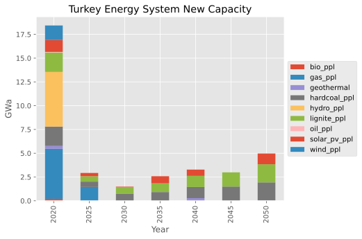
    


```python
rep.set_filters(t=light_and_appliance)
rep.get("plot new capacity")
```


    <Axes: title={'center': 'Turkey Energy System New Capacity'}, xlabel='Year', ylabel='GWa'>


    

    


```python
rep.set_filters(t=plants)
rep.get("plot capacity")
```


    <Axes: title={'center': 'Turkey Energy System Capacity'}, xlabel='Year', ylabel='GW'>


    
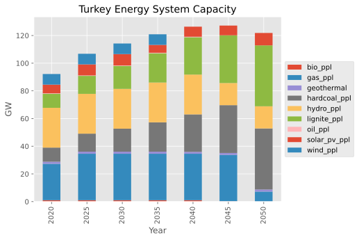
    


```python
rep.set_filters(t=light_and_appliance)
rep.get("plot capacity")
```


    <Axes: title={'center': 'Turkey Energy System Capacity'}, xlabel='Year', ylabel='GW'>


    
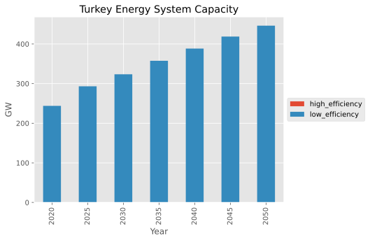
    


```python
rep.get("plot demand")
```

    genno.util - INFO: Add unit definition: GWa = [GWa]


    <Axes: title={'center': 'Turkey Energy System Demand'}, xlabel='Year', ylabel='GWa'>


    
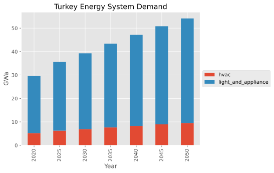
    


```python
rep.set_filters(t=plants)
rep.get("plot activity")
```


    <Axes: title={'center': 'Turkey Energy System Activity'}, xlabel='Year', ylabel='GWa'>


    
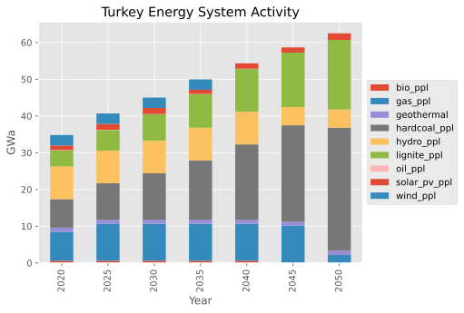
    


```python
rep.set_filters(t=light_and_appliance)
rep.get("plot activity")
```


    <Axes: title={'center': 'Turkey Energy System Activity'}, xlabel='Year', ylabel='GWa'>


    
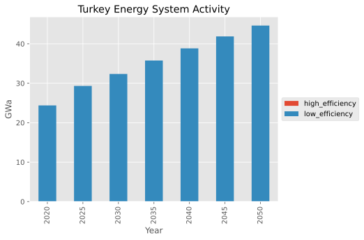
    


```python
rep.set_filters(c=["light_and_appliance", "hvac"])
rep.get("plot prices")
```


    <Axes: title={'center': 'Turkey Energy System Prices'}, xlabel='Year', ylabel='¢/kW·h'>


    
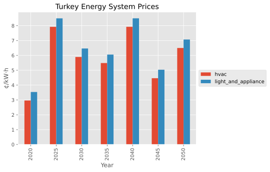
    


The parameters peak_load_factor (maximum peak load factor for reliability constraint of firm capacity) and reliability_factor (reliability of a technology (per rating)) are based on the formulation proposed by Sullivan et al., 2013 [11]. It is used in Reliability of installed capacity.


```python
mp.close_db()
```


```python

```
