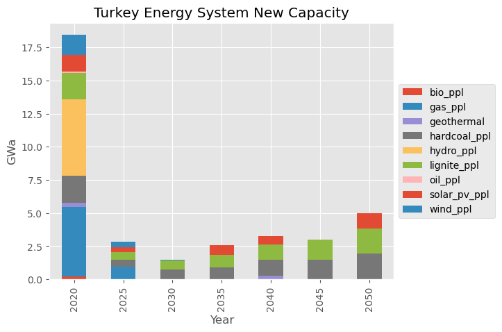
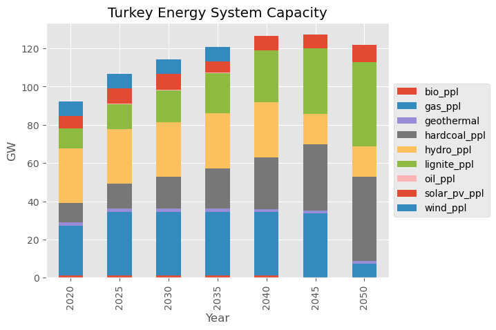
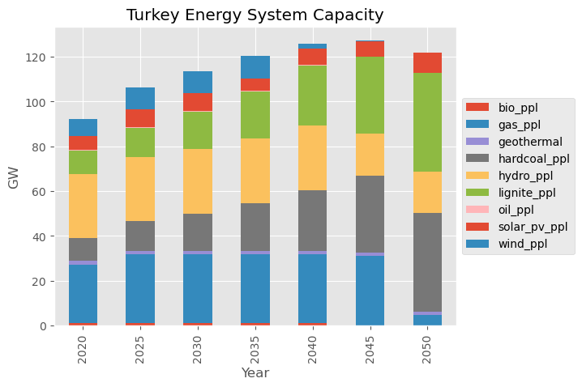
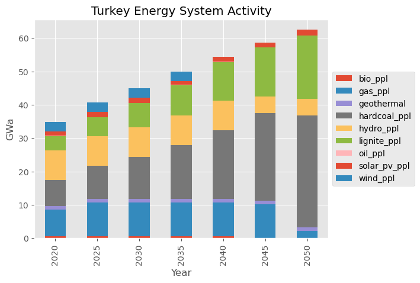
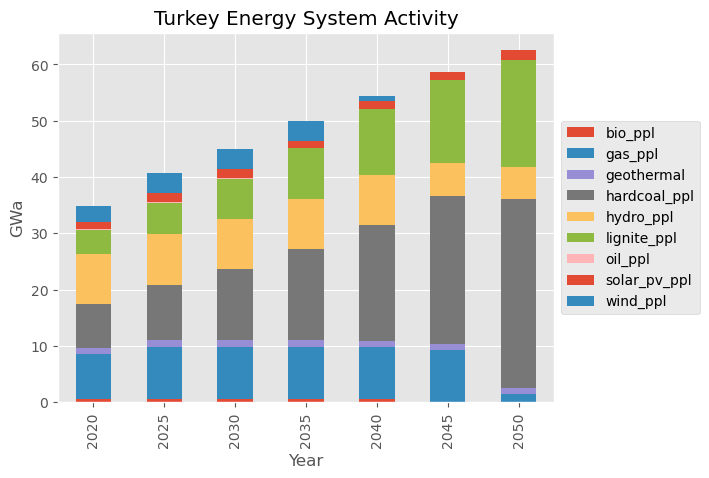

# Turkish power sector Tutorial Part 3: A Policy Scenario

This tutorial is based on the [Austria Energy System](https://docs.messageix.org/en/stable/tutorials.html#austrian-energy-system) tutorial of *MESSAGEix*.

**Pre-requisites**
- You have the *MESSAGEix* framework installed and working
- You have run Turkish energy system baseline scenario (``turkey_revA.ipynb``) and solved it successfully

**Introduction**

In this notebook, we will step through creating and investigating a policy scenario.

We will look into the effect of wind generation subsidies on the electricity sector. These subsidies will take the form of capital investment subsidies, effectively reducing the costs of capital investment.

# Setup and Helper Variables


```python
# load required packages 
import numpy as np
import pandas as pd

import matplotlib.pyplot as plt
%matplotlib inline
plt.style.use('ggplot')

import ixmp as ix
import message_ix
```


```python
# launch the IX modeling platform using the local default database
mp = ix.Platform(name="local")
```

    2026-07-11 18:02:19,503  INFO at.ac.iiasa.ixmp.Platform:165 - Welcome to the IX modeling platform!
    2026-07-11 18:02:19,520  INFO at.ac.iiasa.ixmp.Platform:166 -  connected to database 'jdbc:hsqldb:file:/home/ggungor/.local/share/ixmp/localdb/default' (user: ixmp)...


```python
country = 'Turkey'

plants = [
    "lignite_ppl",
    "hardcoal_ppl", 
    "gas_ppl", 
    "oil_ppl", 
    "bio_ppl", 
    "hydro_ppl",
    "wind_ppl", 
    "geothermal",
    "solar_pv_ppl",
]

lights = [
    "low_efficiency", 
    "high_efficiency", 
]
```

# Create the New Policy Scenario Datastructure

This operation is done by cloning the baseline scenario, which will then be edited.


```python
scen_df = mp.scenario_list() # to find the name of the wanted scenario, simply print scen_df
scen_df.loc[scen_df["scenario"] == "baseline"] # to show just the scenario we are interested in
```


<div>
<style scoped>
    .dataframe tbody tr th:only-of-type {
        vertical-align: middle;
    }

    .dataframe tbody tr th {
        vertical-align: top;
    }

    .dataframe thead th {
        text-align: right;
    }
</style>
<table border="1" class="dataframe">
  <thead>
    <tr style="text-align: right;">
      <th></th>
      <th>model</th>
      <th>scenario</th>
      <th>scheme</th>
      <th>is_default</th>
      <th>is_locked</th>
      <th>cre_user</th>
      <th>cre_date</th>
      <th>upd_user</th>
      <th>upd_date</th>
      <th>lock_user</th>
      <th>lock_date</th>
      <th>annotation</th>
      <th>version</th>
    </tr>
  </thead>
  <tbody>
    <tr>
      <th>0</th>
      <td>Turkey energy model</td>
      <td>baseline</td>
      <td>MESSAGE</td>
      <td>1</td>
      <td>0</td>
      <td>ggungor</td>
      <td>2026-03-24 20:57:43.693000</td>
      <td>ggungor</td>
      <td>2026-07-11 17:58:02.455000</td>
      <td>None</td>
      <td>None</td>
      <td>initial commit for Turkey model</td>
      <td>5</td>
    </tr>
    <tr>
      <th>4</th>
      <td>Westeros Electrified</td>
      <td>baseline</td>
      <td>MESSAGE</td>
      <td>1</td>
      <td>0</td>
      <td>ggungor</td>
      <td>2026-03-22 13:50:44.368000</td>
      <td>ggungor</td>
      <td>2026-03-22 13:51:11.763000</td>
      <td>None</td>
      <td>None</td>
      <td>basic model of Westerosi electrification</td>
      <td>1</td>
    </tr>
  </tbody>
</table>
</div>


```python
model = "Turkey energy model"
scen = "baseline"
mp.open_db() # only open if you're on a local database!
base = message_ix.Scenario(mp, model, scen)
scenario = base.clone(model, 'wind subsidies', 'testing wind subsidies', keep_solution=False)
scenario.check_out()
```


```python
mp.scenario_list()
```


<div>
<style scoped>
    .dataframe tbody tr th:only-of-type {
        vertical-align: middle;
    }

    .dataframe tbody tr th {
        vertical-align: top;
    }

    .dataframe thead th {
        text-align: right;
    }
</style>
<table border="1" class="dataframe">
  <thead>
    <tr style="text-align: right;">
      <th></th>
      <th>model</th>
      <th>scenario</th>
      <th>scheme</th>
      <th>is_default</th>
      <th>is_locked</th>
      <th>cre_user</th>
      <th>cre_date</th>
      <th>upd_user</th>
      <th>upd_date</th>
      <th>lock_user</th>
      <th>lock_date</th>
      <th>annotation</th>
      <th>version</th>
    </tr>
  </thead>
  <tbody>
    <tr>
      <th>0</th>
      <td>Turkey energy model</td>
      <td>baseline</td>
      <td>MESSAGE</td>
      <td>1</td>
      <td>0</td>
      <td>ggungor</td>
      <td>2026-03-24 20:57:43.693000</td>
      <td>ggungor</td>
      <td>2026-07-11 17:58:02.455000</td>
      <td>None</td>
      <td>None</td>
      <td>initial commit for Turkey model</td>
      <td>5</td>
    </tr>
    <tr>
      <th>1</th>
      <td>Turkey energy model</td>
      <td>cheap_cfls</td>
      <td>MESSAGE</td>
      <td>1</td>
      <td>0</td>
      <td>ggungor</td>
      <td>2026-03-24 21:03:18.466000</td>
      <td>ggungor</td>
      <td>2026-03-24 21:03:49.497000</td>
      <td>None</td>
      <td>None</td>
      <td>clone Scenario from 'Turkey energy model|basel...</td>
      <td>4</td>
    </tr>
    <tr>
      <th>2</th>
      <td>Turkey energy model</td>
      <td>solar subsidies</td>
      <td>MESSAGE</td>
      <td>1</td>
      <td>0</td>
      <td>ggungor</td>
      <td>2026-07-11 18:09:39.792000</td>
      <td>ggungor</td>
      <td>2026-07-11 18:10:22.937000</td>
      <td>None</td>
      <td>None</td>
      <td>clone Scenario from 'Turkey energy model|basel...</td>
      <td>3</td>
    </tr>
    <tr>
      <th>3</th>
      <td>Turkey energy model</td>
      <td>solar_subsidies</td>
      <td>MESSAGE</td>
      <td>1</td>
      <td>0</td>
      <td>ggungor</td>
      <td>2026-03-24 20:59:25.426000</td>
      <td>ggungor</td>
      <td>2026-03-24 20:59:40.768000</td>
      <td>None</td>
      <td>None</td>
      <td>clone Scenario from 'Turkey energy model|basel...</td>
      <td>2</td>
    </tr>
    <tr>
      <th>4</th>
      <td>Turkey energy model</td>
      <td>wind subsidies</td>
      <td>MESSAGE</td>
      <td>1</td>
      <td>0</td>
      <td>ggungor</td>
      <td>2026-07-11 18:14:07.358000</td>
      <td>ggungor</td>
      <td>2026-07-11 18:15:03.536000</td>
      <td>None</td>
      <td>None</td>
      <td>clone Scenario from 'Turkey energy model|basel...</td>
      <td>2</td>
    </tr>
    <tr>
      <th>5</th>
      <td>Westeros Electrified</td>
      <td>baseline</td>
      <td>MESSAGE</td>
      <td>1</td>
      <td>0</td>
      <td>ggungor</td>
      <td>2026-03-22 13:50:44.368000</td>
      <td>ggungor</td>
      <td>2026-03-22 13:51:11.763000</td>
      <td>None</td>
      <td>None</td>
      <td>basic model of Westerosi electrification</td>
      <td>1</td>
    </tr>
  </tbody>
</table>
</div>


```python
horizon = scenario.set('year')
```

# Edit the Datastructure with the Scenario Parameters

Introduce subsidies that decay with time. Initially they are 100% of the total investment costs and decay to 50%.


```python
inv_cost_df = scenario.par('inv_cost')
inv_cost_df.loc[inv_cost_df["technology"] == "wind_ppl"]
```


<div>
<style scoped>
    .dataframe tbody tr th:only-of-type {
        vertical-align: middle;
    }

    .dataframe tbody tr th {
        vertical-align: top;
    }

    .dataframe thead th {
        text-align: right;
    }
</style>
<table border="1" class="dataframe">
  <thead>
    <tr style="text-align: right;">
      <th></th>
      <th>node_loc</th>
      <th>technology</th>
      <th>year_vtg</th>
      <th>value</th>
      <th>unit</th>
    </tr>
  </thead>
  <tbody>
    <tr>
      <th>42</th>
      <td>Turkey</td>
      <td>wind_ppl</td>
      <td>2020</td>
      <td>1767.0</td>
      <td>USD/kW</td>
    </tr>
    <tr>
      <th>43</th>
      <td>Turkey</td>
      <td>wind_ppl</td>
      <td>2025</td>
      <td>1767.0</td>
      <td>USD/kW</td>
    </tr>
    <tr>
      <th>44</th>
      <td>Turkey</td>
      <td>wind_ppl</td>
      <td>2030</td>
      <td>1767.0</td>
      <td>USD/kW</td>
    </tr>
    <tr>
      <th>45</th>
      <td>Turkey</td>
      <td>wind_ppl</td>
      <td>2035</td>
      <td>1767.0</td>
      <td>USD/kW</td>
    </tr>
    <tr>
      <th>46</th>
      <td>Turkey</td>
      <td>wind_ppl</td>
      <td>2040</td>
      <td>1767.0</td>
      <td>USD/kW</td>
    </tr>
    <tr>
      <th>47</th>
      <td>Turkey</td>
      <td>wind_ppl</td>
      <td>2045</td>
      <td>1767.0</td>
      <td>USD/kW</td>
    </tr>
    <tr>
      <th>48</th>
      <td>Turkey</td>
      <td>wind_ppl</td>
      <td>2050</td>
      <td>1767.0</td>
      <td>USD/kW</td>
    </tr>
  </tbody>
</table>
</div>


```python
subsidies = np.array([0, 0.1, 0.2, 0.3, 0.4, 0.5, 0.5])
inv_cost = pd.DataFrame({
        'node_loc': country,
        'year_vtg': horizon,
        'technology': 'wind_ppl',
        'value': 1767 * subsidies,
        'unit': 'USD/kW',
})
scenario.add_par('inv_cost', inv_cost)
```


```python
scenario.par("inv_cost").loc[inv_cost_df["technology"] == "wind_ppl"]
```


<div>
<style scoped>
    .dataframe tbody tr th:only-of-type {
        vertical-align: middle;
    }

    .dataframe tbody tr th {
        vertical-align: top;
    }

    .dataframe thead th {
        text-align: right;
    }
</style>
<table border="1" class="dataframe">
  <thead>
    <tr style="text-align: right;">
      <th></th>
      <th>node_loc</th>
      <th>technology</th>
      <th>year_vtg</th>
      <th>value</th>
      <th>unit</th>
    </tr>
  </thead>
  <tbody>
    <tr>
      <th>42</th>
      <td>Turkey</td>
      <td>wind_ppl</td>
      <td>2020</td>
      <td>0.0</td>
      <td>USD/kW</td>
    </tr>
    <tr>
      <th>43</th>
      <td>Turkey</td>
      <td>wind_ppl</td>
      <td>2025</td>
      <td>176.7</td>
      <td>USD/kW</td>
    </tr>
    <tr>
      <th>44</th>
      <td>Turkey</td>
      <td>wind_ppl</td>
      <td>2030</td>
      <td>353.4</td>
      <td>USD/kW</td>
    </tr>
    <tr>
      <th>45</th>
      <td>Turkey</td>
      <td>wind_ppl</td>
      <td>2035</td>
      <td>530.1</td>
      <td>USD/kW</td>
    </tr>
    <tr>
      <th>46</th>
      <td>Turkey</td>
      <td>wind_ppl</td>
      <td>2040</td>
      <td>706.8</td>
      <td>USD/kW</td>
    </tr>
    <tr>
      <th>47</th>
      <td>Turkey</td>
      <td>wind_ppl</td>
      <td>2045</td>
      <td>883.5</td>
      <td>USD/kW</td>
    </tr>
    <tr>
      <th>48</th>
      <td>Turkey</td>
      <td>wind_ppl</td>
      <td>2050</td>
      <td>883.5</td>
      <td>USD/kW</td>
    </tr>
  </tbody>
</table>
</div>


# Solve the Model


```python
scenario.commit('wind subsidies added')
scenario.set_as_default()
```


```python
scenario.solve()
```

    --- Warning: The GAMS version [51.3.0] differs from the API version [24.8.3].
    --- Job MESSAGE_run.gms Start 07/11/26 18:17:44 51.3.0 38407a9b LEX-LEG x86 64bit/Linux
    --- Applying:
        /home/ggungor/Downloads/gams51.3_linux_x64_64_sfx/gmsprmun.txt
    --- GAMS Parameters defined
        Input /home/ggungor/miniconda3/lib/python3.12/site-packages/message_ix/model/MESSAGE_run.gms
        ScrDir /home/ggungor/miniconda3/lib/python3.12/site-packages/message_ix/model/225a/
        SysDir /home/ggungor/Downloads/gams51.3_linux_x64_64_sfx/
        LogOption 4
        LogFile /home/ggungor/miniconda3/lib/python3.12/site-packages/message_ix/model/MESSAGE_run.log
        AppendLog 1
        --in /home/ggungor/miniconda3/lib/python3.12/site-packages/message_ix/model/data/MsgData_Turkey_energy_model_wind_subsidies.gdx
        --out /home/ggungor/miniconda3/lib/python3.12/site-packages/message_ix/model/output/MsgOutput_Turkey_energy_model_wind_subsidies.gdx
        --iter /home/ggungor/miniconda3/lib/python3.12/site-packages/message_ix/model/output/MsgIterationReport_Turkey_energy_model_wind_subsidies.gdx
    Licensee: G?rkem G?ng?r                                  G260118+0003Ac-GEN
              ggungor@mezun.hacettepe.edu.tr                          CLA115848
              /home/ggungor/Downloads/gams51.3_linux_x64_64_sfx/gamslice.txt
              node:60351003 v:2                                                
              Community license for demonstration and instructional purposes only
    System information: 2 physical cores and 4 Gb physical memory detected
    GAMS 51.3.0   Copyright (C) 1987-2025 GAMS Development. All rights reserved
    --- Starting compilation
    --- MESSAGE_run.gms(3) 2 Mb
    --- . copyright.gms(29) 2 Mb
    --- MESSAGE_run.gms(30) 2 Mb
    --- . model_setup.gms(66) 2 Mb
    --- .. auxiliary_settings.gms(37) 2 Mb
    --- . model_setup.gms(69) 2 Mb
    --- .. version.gms(23) 2 Mb
    --- . model_setup.gms(70) 2 Mb
    --- .. version_check.gms(7) 2 Mb
    --- GDXin=/home/ggungor/miniconda3/lib/python3.12/site-packages/message_ix/model/data/MsgData_Turkey_energy_model_wind_subsidies.gdx
    --- GDX File ($gdxIn) /home/ggungor/miniconda3/lib/python3.12/site-packages/message_ix/model/data/MsgData_Turkey_energy_model_wind_subsidies.gdx
    --- .. version_check.gms(24) 3 Mb
    --- . model_setup.gms(73) 3 Mb
    --- .. sets_maps_def.gms(511) 3 Mb
    --- . model_setup.gms(74) 3 Mb
    --- .. parameter_def.gms(907) 3 Mb
    --- . model_setup.gms(77) 3 Mb
    --- .. data_load.gms(9) 3 Mb
    --- GDXin=/home/ggungor/miniconda3/lib/python3.12/site-packages/message_ix/model/data/MsgData_Turkey_energy_model_wind_subsidies.gdx
    --- GDX File ($gdxIn) /home/ggungor/miniconda3/lib/python3.12/site-packages/message_ix/model/data/MsgData_Turkey_energy_model_wind_subsidies.gdx
    --- .. data_load.gms(126) 3 Mb
    --- ... period_parameter_assignment.gms(118) 3 Mb
    --- .. data_load.gms(269) 3 Mb
    --- . model_setup.gms(80) 3 Mb
    --- .. scaling_investment_costs.gms(182) 3 Mb
    --- . model_setup.gms(86) 3 Mb
    --- .. model_core.gms(2339) 3 Mb
    --- . model_setup.gms(86) 3 Mb
    --- MESSAGE_run.gms(36) 3 Mb
    --- . model_solve.gms(109) 3 Mb
    --- .. aux_computation_time.gms(14) 3 Mb
    --- . model_solve.gms(175) 3 Mb
    --- MESSAGE_run.gms(43) 3 Mb
    --- . reporting.gms(26) 3 Mb
    --- MESSAGE_run.gms(52) 3 Mb
    --- Starting execution: elapsed 0:00:00.034
    --- MESSAGE_run.gms(1644) 4 Mb
        +++ Importing data from '/home/ggungor/miniconda3/lib/python3.12/site-packages/message_ix/model/data/MsgData_Turkey_energy_model_wind_subsidies.gdx'... +++
    --- MESSAGE_run.gms(1669) 4 Mb
    --- GDXin=/home/ggungor/miniconda3/lib/python3.12/site-packages/message_ix/model/data/MsgData_Turkey_energy_model_wind_subsidies.gdx
    --- GDX File (execute_load) /home/ggungor/miniconda3/lib/python3.12/site-packages/message_ix/model/data/MsgData_Turkey_energy_model_wind_subsidies.gdx
    --- MESSAGE_run.gms(4570) 4 Mb
        +++ Solve the perfect-foresight version of MESSAGEix +++
    --- Generating LP model MESSAGE_LP
    --- MESSAGE_run.gms(4588) 5 Mb
    ---   760 rows  621 columns  2,651 non-zeroes
    --- Range statistics (absolute non-zero finite values)
    --- RHS       [min, max] : [ 8.037E-02, 4.462E+01] - Zero values observed as well
    --- Bound     [min, max] : [        NA,        NA] - Zero values observed as well
    --- Matrix    [min, max] : [ 1.000E-01, 3.100E+03]
    --- Executing CPLEX (Solvelink=2): elapsed 0:00:00.048
    
    IBM ILOG CPLEX   51.3.0 38407a9b Oct 27, 2025          LEG x86 64bit/Linux    
    
    *** This solver runs with a community license. No commercial use.
    
    Reading parameter(s) from "/home/ggungor/miniconda3/lib/python3.12/site-packages/message_ix/model/cplex.opt"
    >>  advind = 0
    >>  lpmethod = 4
    >>  threads = 4
    >>  epopt = 1e-06
    Finished reading from "/home/ggungor/miniconda3/lib/python3.12/site-packages/message_ix/model/cplex.opt"
    
    --- GMO setup time: 0.00s
    --- Space for names approximately 0.07 Mb
    --- Use option 'names no' to turn use of names off
    --- GMO memory 0.66 Mb (peak 0.66 Mb)
    --- Dictionary memory 0.00 Mb
    --- Cplex 22.1.2.0 link memory 0.02 Mb (peak 0.13 Mb)
    --- Starting Cplex
    
    Version identifier: 22.1.2.0 | 2024-11-26 | 0edbb82fd
    CPXPARAM_Advance                                 0
    CPXPARAM_LPMethod                                4
    CPXPARAM_Threads                                 4
    CPXPARAM_Parallel                                1
    CPXPARAM_MIP_Display                             4
    CPXPARAM_MIP_Pool_Capacity                       0
    CPXPARAM_Barrier_Limits_Iteration                100000000
    CPXPARAM_TimeLimit                               1000000
    CPXPARAM_MIP_Tolerances_AbsMIPGap                0
    CPXPARAM_MIP_Tolerances_MIPGap                   0
    Tried aggregator 1 time.
    LP Presolve eliminated 269 rows and 142 columns.
    Aggregator did 118 substitutions.
    Reduced LP has 372 rows, 411 columns, and 1338 nonzeros.
    Presolve time = 0.00 sec. (0.96 ticks)
    Parallel mode: using up to 4 threads for barrier.
    Number of nonzeros in lower triangle of A*A' = 1217
    Using Approximate Minimum Degree ordering
    Total time for automatic ordering = 0.00 sec. (0.20 ticks)
    Summary statistics for Cholesky factor:
      Threads                   = 4
      Rows in Factor            = 372
      Integer space required    = 795
      Total non-zeros in factor = 4477
      Total FP ops to factor    = 64047
     Itn      Primal Obj        Dual Obj  Prim Inf Upper Inf  Dual Inf Inf Ratio
       0   2.2188266e+06   2.2164042e+05  8.41e+03  8.97e+01  4.60e+03  1.00e+00
       1   1.8529365e+06   2.2510590e+05  6.86e+03  7.32e+01  2.16e+03  1.95e-03
       2   1.4253449e+06   2.4444756e+05  5.00e+03  5.33e+01  1.42e+03  1.67e-03
       3   1.1763273e+06   2.9434336e+05  3.78e+03  4.03e+01  9.81e+02  1.67e-03
       4   7.8182791e+05   3.0222041e+05  2.02e+03  2.15e+01  7.57e+02  1.80e-03
       5   6.1958708e+05   3.4824814e+05  1.23e+03  1.32e+01  1.98e+02  4.16e-03
       6   5.0996529e+05   3.6768226e+05  6.70e+02  7.14e+00  7.68e+01  9.54e-03
       7   4.3426667e+05   3.7736742e+05  2.69e+02  2.87e+00  2.97e+01  1.94e-02
       8   4.0497114e+05   3.8306875e+05  1.02e+02  1.09e+00  1.22e+01  3.58e-02
       9   3.9786003e+05   3.8555430e+05  4.88e+01  5.20e-01  8.53e+00  4.60e-02
      10   3.9259369e+05   3.8939442e+05  1.46e+01  1.56e-01  1.70e+00  2.33e-01
      11   3.9106517e+05   3.9010716e+05  4.33e+00  4.62e-02  5.17e-01  7.19e-01
      12   3.9060965e+05   3.9038442e+05  1.20e+00  1.28e-02  7.87e-02  4.30e+00
      13   3.9047254e+05   3.9042008e+05  2.72e-01  2.91e-03  2.03e-02  1.02e+01
      14   3.9044884e+05   3.9044349e+05  3.41e-02  3.64e-04  1.57e-03  1.33e+02
      15   3.9044566e+05   3.9044499e+05  3.65e-03  3.89e-05  2.47e-04  7.16e+02
      16   3.9044534e+05   3.9044534e+05  1.57e-06  1.67e-08  1.81e-07  9.95e+05
      17   3.9044534e+05   3.9044534e+05  3.14e-09  1.72e-12  5.38e-08  1.29e+10
    Barrier time = 0.02 sec. (3.09 ticks)
    Parallel mode: deterministic, using up to 4 threads for concurrent optimization:
     * Starting dual Simplex on 1 thread...
     * Starting primal Simplex on 1 thread...
    
    Dual crossover.
      Dual:  Fixing 137 variables.
          136 DMoves:  Infeasibility  0.00000000e+00  Objective  3.90445343e+05
           55 DMoves:  Infeasibility  0.00000000e+00  Objective  3.90445343e+05
            0 DMoves:  Infeasibility  0.00000000e+00  Objective  3.90445343e+05
      Dual:  Pushed 7, exchanged 130.
      Primal:  Fixed no variables.
    
    Dual simplex solved model.
    
    Total crossover time = 0.00 sec. (1.02 ticks)
    
    Total time on 4 threads = 0.02 sec. (5.09 ticks)
    
    --- LP status (1): optimal.
    --- Cplex Time: 0.02sec (det. 5.09 ticks)
    
    
    Optimal solution found
    Objective:       390445.342675
    
    --- Reading solution for model MESSAGE_LP
    --- Executing after solve: elapsed 0:00:00.110
    --- MESSAGE_run.gms(4786) 5 Mb
    --- GDX File (execute_unload) /home/ggungor/miniconda3/lib/python3.12/site-packages/message_ix/model/output/MsgOutput_Turkey_energy_model_wind_subsidies.gdx
    --- MESSAGE_run.gms(4788) 5 Mb
        +++ End of MESSAGEix (stand-alone) run - have a nice day! +++
    *** Status: Normal completion
    --- Job MESSAGE_run.gms Stop 07/11/26 18:17:44 elapsed 0:00:00.113
    --- Warning: The GAMS version [51.3.0] differs from the API version [24.8.3].
    --- Warning: The GAMS version [51.3.0] differs from the API version [24.8.3].


    2026-07-11 18:17:44,461 ERROR at.ac.iiasa.ixmp.objects.Scenario:1691 - variable 'I' not found in gdx!
    2026-07-11 18:17:44,463 ERROR at.ac.iiasa.ixmp.objects.Scenario:1691 - variable 'C' not found in gdx!


```python
scenario.var('OBJ')['lvl']
```


    390445.34375


# Investigate the Results


```python
from message_ix.reporting import Reporter
from message_ix.util.tutorial import prepare_plots

config = dict(filters=dict(t=plants))
base_rep = Reporter.from_scenario(base, **config)
prepare_plots(base_rep)
scen_rep = Reporter.from_scenario(scenario, **config)
prepare_plots(scen_rep)
```


```python
base_rep.get("plot new capacity")
scen_rep.get("plot new capacity")
```


    <Axes: title={'center': 'Turkey Energy System New Capacity'}, xlabel='Year', ylabel='GWa'>


    

    


    

    


```python
base_rep.get("plot capacity")
scen_rep.get("plot capacity")
```


    <Axes: title={'center': 'Turkey Energy System Capacity'}, xlabel='Year', ylabel='GW'>


    

    


    

    


```python
base_rep.get("plot activity")
scen_rep.get("plot activity")
```


    <Axes: title={'center': 'Turkey Energy System Activity'}, xlabel='Year', ylabel='GWa'>


    

    


    

    


```python
mp.close_db()
```


```python

```
